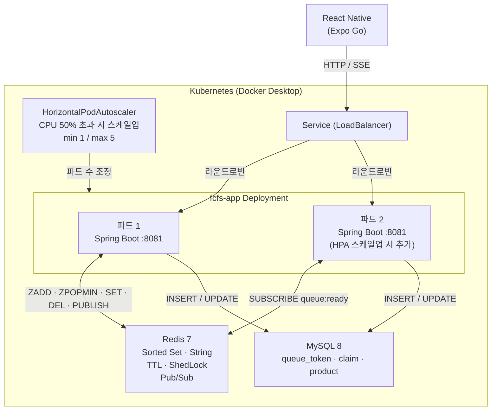
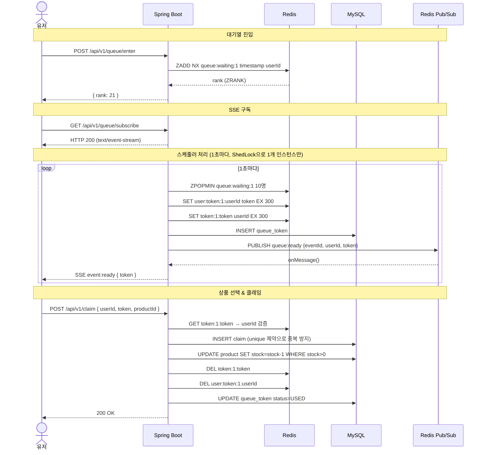
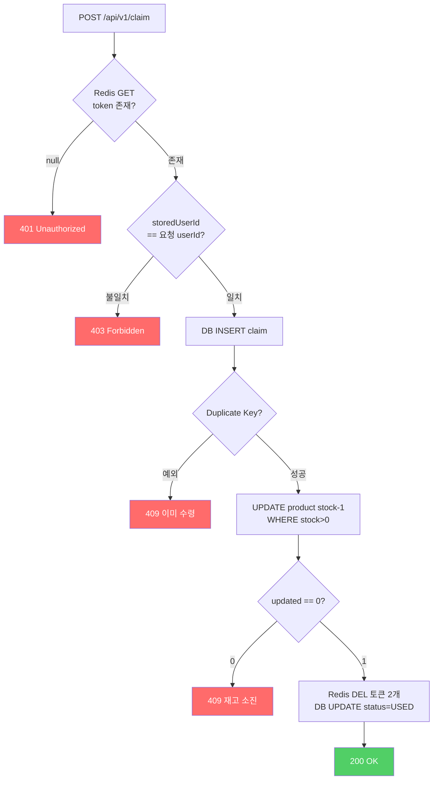

# 면접 준비 — 선착순 대기열 시스템

> 직접 구현하고 디버깅한 내용을 바탕으로 한 기술 면접 완전 대비 문서.
> 모든 Q&A는 실제 코드와 실제 발생한 버그에서 나왔다.

---

## 목차

1. [프로젝트 개요](#1-프로젝트-개요)
2. [시스템 흐름도](#2-시스템-흐름도)
3. [아키텍처 전반](#3-아키텍처-전반)
4. [대기열 설계](#4-대기열-설계)
5. [Redis](#5-redis)
6. [동시성과 중복 방지](#6-동시성과-중복-방지)
7. [ShedLock — 분산 스케줄러](#7-shedlock--분산-스케줄러)
8. [SSE와 Redis Pub/Sub](#8-sse와-redis-pubsub)
9. [트랜잭션 경계](#9-트랜잭션-경계)
10. [실제 버그 디버깅 경험](#10-실제-버그-디버깅-경험)
11. [Kubernetes와 HPA](#11-kubernetes와-hpa)
12. [DB 설계](#12-db-설계)
13. [만료 토큰 배치](#13-만료-토큰-배치)
14. [Outbox 패턴과 분산 트랜잭션](#14-outbox-패턴과-분산-트랜잭션)
15. [부하 테스트 (k6)](#15-부하-테스트-k6)
16. [테스트 전략](#16-테스트-전략)
17. [개선 방향](#17-개선-방향)
18. [빠른 답변 키워드](#18-빠른-답변-키워드)
19. [JVM OOMKilled 실험](#19-jvm-oomkilled-실험)
20. [서버 초기화 & 이벤트 복구](#20-서버-초기화--이벤트-복구)
21. [스케줄링 심화](#21-스케줄링-심화)
22. [JPA & DB 심화](#22-jpa--db-심화)
23. [설계 결정 상세](#23-설계-결정-상세)

---

## 1. 프로젝트 개요

**Q. 이 프로젝트를 한 줄로 소개해주세요.**

> 스타벅스 프리퀀시 같은 선착순 한정 수량 지급 시스템입니다. Spring Boot 백엔드와 React Native 프론트엔드로 구성된 모노레포이며, 대기열 입장 → 순서 대기 → 토큰 발급 → 상품 선택 → 클레임까지의 전체 흐름을 구현했습니다. 단순 기능 구현보다는 동시성 처리, 다중 인스턴스 환경에서의 상태 공유, Kubernetes HPA 자동 스케일링, k6 부하 테스트를 목적으로 진행했습니다.

**핵심 기술 스택**: Spring Boot 3, Redis (대기열 + Pub/Sub + 분산락), MySQL, Kubernetes, SSE, ShedLock

---

## 2. 시스템 흐름도

### 인프라 구조



### 전체 유저 플로우



### 중복 클레임 방지 흐름



---

## 3. 아키텍처 전반

**Q. Docker Compose에서 Kubernetes로 전환한 이유가 뭔가요?**

> Docker Compose는 인스턴스 수를 코드에 하드코딩해야 합니다. 평소엔 2개가 과하고, 이벤트 시작 순간엔 2개도 부족합니다. 인스턴스를 추가하려면 compose 파일을 수정하고 다시 올려야 하는데 개발자가 개입해야 합니다.
>
> Kubernetes HPA는 metrics-server가 수집한 CPU 사용률을 보고 알아서 파드를 추가하거나 줄입니다. 이벤트 시작 순간 트래픽이 몰리면 자동으로 파드가 늘어나고, 이벤트가 끝나면 다시 줄어듭니다.

**Q. 왜 모노레포 구조를 선택했나요?**

> 백엔드와 프론트엔드가 긴밀하게 연동되는 시스템이라 API 스펙이 자주 바뀝니다. 레포를 분리하면 양쪽을 동시에 수정할 때 PR을 두 곳에 올려야 하고 변경 이력 추적도 어렵습니다. 모노레포로 두면 하나의 커밋에서 백엔드 API 변경과 프론트 코드 변경을 같이 볼 수 있어서 히스토리 관리가 편합니다.

---

## 4. 대기열 설계

**Q. 대기열을 어떻게 구현했나요?**

> Redis의 Sorted Set을 사용했습니다. 유저가 입장할 때 `ZADD queue:waiting:{eventId} <입장시각> <userId>` 명령으로 추가합니다. Sorted Set은 score 기준으로 항상 정렬되어 있어서, 입장 시각을 score로 쓰면 먼저 들어온 순서대로 자동 정렬됩니다.
>
> 1초마다 실행되는 스케줄러가 `ZPOPMIN` 명령으로 앞에서 10명씩 꺼내 UUID 토큰을 발급합니다. `ZPOPMIN`은 꺼내는 동시에 Set에서 제거하는 원자적 연산이라 다중 인스턴스에서도 같은 유저가 중복 처리되지 않습니다.

**Q. 처음에는 어떻게 구현했고, 어떤 문제가 있었나요?**

> 처음에는 JVM 메모리의 `ConcurrentHashMap`과 `AtomicLong`으로 구현했습니다.
>
> ```java
> ConcurrentHashMap<Long, Long>   userSequence   // userId → 순번
> ConcurrentHashMap<Long, String> userToken      // userId → 토큰
> AtomicLong sequenceCounter   // 순번 발급 카운터 (JVM 안에서만 유일)
> AtomicLong processingCursor  // 처리된 마지막 순번
> ```
>
> 단일 서버에서는 동작했지만 세 가지 치명적 문제가 있었습니다.
>
> **① Cursor 선행 버그**: `@Scheduled`가 서버 시작부터 1초마다 cursor를 +10씩 올립니다. 서버 기동 30초 후 첫 유저가 입장하면 cursor=300인데 seq=1이라 즉시 토큰이 발급됩니다.
>
> **② 다중 인스턴스 불가**: app1/app2가 각자 별개의 메모리에 `AtomicLong`을 가져 순번이 충돌합니다. userId=777이 app1에서 3번, app2에서 3번을 동시에 받는 상황이 발생합니다.
>
> **③ 스케줄러 중복 실행**: 양쪽에서 동시 실행되어 10명이 아닌 20명이 한 번에 처리됩니다.
>
> Redis 전환으로 세 문제를 모두 해소했습니다.

**전환 전/후 비교**

| 항목 | ConcurrentHashMap | Redis |
|------|-------------------|-------|
| 순번 발급 | JVM AtomicLong (인스턴스별 독립) | ZADD score=timestamp (공유) |
| 대기열 | ConcurrentHashMap | Sorted Set |
| 토큰 저장 | ConcurrentHashMap (만료 없음) | String + TTL |
| 서버 재시작 | 큐 초기화 | 유지 |
| 다중 인스턴스 | 상태 충돌 | 공유 상태 |
| 스케줄러 | 모든 인스턴스 실행 | ShedLock으로 1개만 실행 |
| 알림 방식 | 2초 폴링 | SSE 푸시 + 폴링 fallback |
| 클레임 중복 방지 | 없음 | DB unique constraint |

**Q. ZADD할 때 score로 timestamp를 쓰는 이유가 뭔가요?**

> Redis에서 원자적 증가 카운터(`INCR`)를 별도로 관리하는 부담을 없애기 위해서입니다. 입장 시각 자체가 자연스러운 정렬 기준입니다. 밀리초 단위라 같은 ms에 여러 명이 동시에 들어오면 score가 같아지는데, Redis Sorted Set은 score가 같으면 member의 사전순으로 정렬합니다. ms 단위 동시 입장은 실질적으로 구분이 불가능하므로 허용 가능한 수준입니다.

---

## 5. Redis

**Q. Redis를 왜 선택했나요?**

> 단순 key-value 캐시가 아닌 다양한 자료구조가 필요했습니다. 순위 조회(Sorted Set), TTL 자동 만료(String with EX), 원자적 pop(ZPOPMIN), 인스턴스 간 이벤트 전달(Pub/Sub)이 모두 필요한데 Redis가 이를 기본으로 제공합니다. Memcached는 key-value만 지원해서 이런 연산을 애플리케이션 레벨에서 직접 구현해야 합니다.

**Q. Redis 키를 어떻게 설계했나요?**

> 세 종류의 키를 사용합니다.
>
> - `queue:waiting:{eventId}` — Sorted Set. 대기 중인 유저들의 줄.
> - `user:token:{eventId}:{userId}` — String. 유저에게 발급된 토큰. `getStatus()` 조회용.
> - `token:{eventId}:{uuid}` — String. 토큰 → userId 역방향 인덱스. Claim API 검증용.
>
> 키 이름에 `{eventId}`를 포함시킨 이유는 이벤트 격리입니다. 여러 이벤트가 동시에 진행될 때 키가 섞이지 않도록 합니다.

**Q. 토큰에 TTL을 왜 걸었나요?**

> 토큰 유효 시간을 5분으로 제한합니다. 5분 안에 클레임하지 않으면 기회가 사라집니다. TTL을 쓰면 만료 스케줄러를 별도로 만들 필요 없이 Redis가 알아서 키를 삭제합니다. Claim API에서 Redis 키가 없으면 만료로 판단하면 되니까 만료 처리 로직이 단순해집니다.

**Q. claim 후 Redis 키 정리에서 실수가 있었나요?**

> **있었습니다.** 처음에는 `token:{eventId}:{token}` 키만 삭제하고 `user:token:{eventId}:{userId}` 키는 그대로 뒀습니다.
>
> `getStatus()`는 `user:token` 키를 먼저 확인합니다. 키가 남아있으면 수령 완료 후에도 5분간 "준비됨" 상태를 반환합니다. 사용자가 이미 받았는데도 ready 화면이 유지되는 혼란이 생겼습니다.
>
> ```java
> // 수정 후: 두 키 모두 삭제
> redis.delete("token:" + eventId + ":" + token);
> redis.delete("user:token:" + eventId + ":" + userId); // ← 추가
> ```

**Q. Redis가 장애나면 어떻게 되나요?**

> 현재 구현에서는 대기열 상태가 사라집니다. 운영 환경에서는 Redis Sentinel(자동 장애 감지 + 페일오버)이나 Redis Cluster(샤딩 + 복제)를 써서 가용성을 높입니다. 토큰 발급 이력은 MySQL에도 저장하기 때문에 "누가 토큰을 받았는가"에 대한 기록은 Redis 장애와 무관하게 남습니다.

**Q. Redis는 싱글스레드인데 어떻게 원자성이 보장되나요?**

> Redis는 명령 처리를 단일 스레드로 순차적으로 실행합니다. app1과 app2가 동시에 `ZPOPMIN`을 보내도 Redis 내부에서는 하나씩 처리합니다. 첫 번째 `ZPOPMIN`이 10명을 꺼내고 Set에서 제거한 다음, 두 번째 `ZPOPMIN`이 실행될 때는 이미 10명이 없는 상태입니다.

---

## 6. 동시성과 중복 방지

**Q. 같은 유저가 토큰을 두 번 받는 걸 어떻게 막나요?**

> 두 단계로 막습니다.
>
> 첫째, 대기열 진입 시 `ZADD NX`(addIfAbsent)를 사용합니다. 이미 Set에 있는 userId는 추가되지 않아서 대기열에 한 번만 들어갑니다.
>
> 둘째, `queue_token` 테이블에 `UNIQUE KEY (event_id, user_id)` 제약이 있습니다. 같은 이벤트에서 같은 유저의 레코드가 이미 있으면 INSERT가 실패합니다. 이 DB 제약이 최종 보루입니다.

**Q. Claim API에서 중복 클레임을 어떻게 방지하나요?**

> 두 겹으로 방어합니다.
>
> 1차: Redis에서 토큰을 조회합니다. 없으면 만료 또는 이미 소진된 것이므로 즉시 거절합니다.
>
> 2차: `claim` 테이블에 INSERT합니다. `UNIQUE KEY (event_id, user_id)`가 있어서 같은 유저가 두 번 INSERT하려 하면 `DataIntegrityViolationException`이 발생하고, 이를 409 Conflict로 응답합니다.
>
> 1차만으로 부족한 이유: 동시에 두 요청이 들어왔을 때 둘 다 Redis 조회를 통과한 뒤, 첫 번째 요청이 `redis.delete()`를 하기 전에 두 번째 요청도 조회를 통과하는 race condition이 이론적으로 가능합니다. DB unique constraint가 이 경우를 최종적으로 막아줍니다.

**Q. 재고 차감을 어떻게 구현했나요? 동시에 여러 요청이 들어오면 재고가 마이너스가 되지 않나요?**

> `UPDATE product SET stock = stock - 1 WHERE id = ? AND stock > 0` 한 줄로 처리합니다. `stock > 0` 조건을 포함시켜서 재고가 0이면 UPDATE가 실행되지 않습니다. 반환값이 0이면 재고 소진으로 판단해 409를 응답합니다.
>
> 이 방식이 Optimistic Lock이나 Pessimistic Lock보다 단순한 이유는, MySQL의 UPDATE 자체가 row-level lock을 사용해 원자적으로 실행되기 때문입니다.

**Q. 재고 1개 남은 상태에서 동시에 2명이 클레임하면 어떻게 되나요?**

> 두 유저가 서로 다른 경우입니다.
>
> ```
> A: INSERT claim (userId=1) → 성공
> B: INSERT claim (userId=2) → 성공  (다른 유저라 UNIQUE 위반 없음)
>
> A: UPDATE stock=1→0 WHERE stock>0  → updated=1, 성공
> B: UPDATE stock=0   WHERE stock>0  → stock>0 조건 실패, updated=0 → 409 재고소진
>
> B의 @Transactional 롤백 → claim INSERT도 함께 롤백
> ```
>
> MySQL이 두 UPDATE를 동시에 받으면 row-level lock으로 직렬화합니다. 먼저 lock을 잡은 쪽이 `stock=1→0`으로 바꾸고 즉시 해제합니다. 나중에 lock을 얻은 쪽은 이미 `stock=0`이라 `WHERE stock>0` 조건을 통과하지 못해 `updated=0`이 반환됩니다. 재고가 음수가 되는 경우는 없습니다.
>
> 재고 소진으로 실패한 B는 `@Transactional` 롤백으로 claim INSERT도 되돌아가고, Redis 토큰 삭제 코드(step 4)까지 도달하지 못해서 토큰도 살아있습니다. B는 다른 상품을 선택해 재시도할 수 있습니다.

**Q. 비관적 락(Pessimistic Lock)으로 구현하지 않은 이유가 뭔가요?**

> 조건부 UPDATE와 비관적 락의 핵심 차이는 **row lock을 얼마나 오래 잡고 있느냐**입니다.
>
> ```
> 조건부 UPDATE:
>   lock 획득 → (MySQL 내부) stock 읽기 → 조건 평가 → 차감 → lock 해제
>   lock 점유 시간 ≈ 0.1ms (MySQL 내부에서만)
>
> 비관적 락 (SELECT FOR UPDATE):
>   lock 획득 → [네트워크 1ms] → 앱 처리 → [네트워크 1ms] → UPDATE → COMMIT(lock 해제)
>   lock 점유 시간 ≈ 2~10ms (네트워크 왕복 + 앱 처리 포함)
> ```
>
> 동시 요청 100개가 같은 상품을 노릴 때:
>
> ```
> 조건부 UPDATE: 마지막 요청 대기 ≈ 100 × 0.1ms = 10ms
> 비관적 락:     마지막 요청 대기 ≈ 100 × 5ms  = 500ms
> ```
>
> 50배 차이입니다. 비관적 락은 lock을 잡는 동안 DB 커넥션도 점유합니다. 커넥션 풀이 20개인데 요청이 1,000개 몰리면 980개가 커넥션 대기 → 타임아웃 → 503으로 이어집니다. 선착순 이벤트처럼 트래픽이 순간 폭발하는 구조에서 비관적 락은 오히려 더 위험합니다.

**Q. 그러면 비관적 락은 언제 써야 하나요? 금융처럼 중요한 데이터일 때인가요?**

> 중요도가 아니라 **연산 패턴**이 기준입니다.
>
> 단순 잔액 차감은 금융 데이터여도 조건부 UPDATE로 충분합니다.
>
> ```sql
> -- ATM 출금: 재고 차감과 구조가 완전히 같음
> UPDATE account SET balance = balance - 100000
> WHERE id = ? AND balance >= 100000
> ```
>
> 비관적 락이 필요한 건 **"읽어서 → 앱에서 복잡하게 계산하고 → 여러 곳에 쓰는" 패턴**일 때입니다.
>
> ```
> [은행 이체 예시]
> SELECT balance FROM account WHERE id=1 FOR UPDATE  -- A 계좌 잠금
> SELECT balance FROM account WHERE id=2 FOR UPDATE  -- B 계좌 잠금
>
> -- 앱에서: 구간별 수수료 계산, AML 한도 체크, 환율 적용, 이자 정산 ...
>
> UPDATE account SET balance = (계산된 값) WHERE id=1
> UPDATE account SET balance = (계산된 값) WHERE id=2
> INSERT INTO transaction_history ...
> INSERT INTO fee_ledger ...
> COMMIT
> ```
>
> 읽은 값을 앱에서 가공해 여러 테이블에 써야 해서 SQL 한 줄로 표현이 불가능합니다. 이 경우 읽는 시점에 lock을 잡아야 합니다.
>
> | 기준 | 조건부 UPDATE | 비관적 락 |
> |---|---|---|
> | SQL 한 줄로 표현 가능 | ✓ | |
> | 읽어서 앱에서 계산 후 씀 | | ✓ |
> | 여러 row/테이블에 동시 쓰기 | | ✓ |
> | 데이터의 중요도 | 무관 | 무관 |
>
> 금융 시스템에 비관적 락이 자주 등장하는 건 "중요해서"가 아니라 금융 도메인에 "읽어서 복잡하게 계산하고 여러 곳에 쓰는" 패턴이 많기 때문입니다. 이 프로젝트 재고 차감은 단일 row에 단일 SQL이라 조건부 UPDATE가 정확한 선택입니다.

**Q. volatile 키워드가 뭔지 설명해주세요.**

> `volatile`은 변수의 **가시성(Visibility)** 을 보장합니다. 한 스레드가 값을 쓰면 다른 스레드가 캐시가 아닌 메인 메모리에서 최신 값을 읽도록 강제합니다.
>
> 하지만 **원자성(Atomicity)** 은 보장하지 않습니다. 읽기-수정-쓰기 세 단계가 한 번에 일어남을 보장하지 않습니다.

**Q. 프로젝트에서 volatile로 인한 버그가 있었나요?**

> **있었습니다.** `ActiveEventCache`에서 `volatile Set<Long>`을 사용해 활성화된 이벤트 ID를 관리했는데, `add()`와 `refresh()`가 동시에 실행될 때 경쟁 조건이 있었습니다.
>
> ```java
> // 문제 코드: 읽기(A)와 쓰기(B) 사이에 다른 스레드가 끼어들 수 있음
> public void add(Long eventId) {
>     Set<Long> updated = new HashSet<>(activeEventIds); // (A) 읽기
>     updated.add(eventId);
>     this.activeEventIds = Set.copyOf(updated);         // (B) 쓰기
> }
> ```
>
> **레이스 시나리오**: 이벤트 2가 활성화되면서 `add(2L)`이 `{1L}`을 읽음 → 30초 주기 `refresh()`가 DB에서 이벤트 1만 읽어 `{1L}`로 덮어씀 → `add(2L)`이 `{1L, 2L}`을 씀. 문제없어 보이지만, `add(2L)`이 씀 → `refresh()`가 `{1L}`로 덮어쓰는 순서가 되면 이벤트 2가 캐시에서 사라집니다.
>
> 증상: `processQueue()`가 `activeEventCache.getAll()`에서 빈 Set을 받으면 즉시 리턴합니다. 이벤트 2의 대기열이 최대 30초간 처리되지 않습니다.

**Q. 어떻게 해결했나요?**

> `AtomicReference.updateAndGet()`으로 교체했습니다. 내부적으로 CAS(Compare-And-Swap)를 사용해 읽기-수정-쓰기를 원자적으로 처리합니다.
>
> ```java
> private final AtomicReference<Set<Long>> activeEventIds = new AtomicReference<>(Set.of());
>
> public void add(Long eventId) {
>     activeEventIds.updateAndGet(current -> {
>         Set<Long> updated = new HashSet<>(current);
>         updated.add(eventId);
>         return Set.copyOf(updated);
>     });
> }
> ```
>
> CAS 동작 원리:
> 1. 현재 값을 읽음
> 2. 람다 안에서 새 값 계산
> 3. "내가 읽은 값"과 "지금 실제 값"이 같으면 → 교체 성공
> 4. 다르면 (다른 스레드가 중간에 바꿨으면) → 처음부터 재시도

**Q. synchronized로 해결하면 안 됐나요?**

> 됩니다. 다만 `synchronized`는 락을 얻지 못한 스레드가 블로킹됩니다. `AtomicReference`는 락 없이 재시도하는 낙관적 방식(Lock-Free)이라 경쟁이 적은 상황에서 더 효율적입니다. 이 캐시는 이벤트 활성화/종료 시에만 수정되어 경쟁이 적으므로 CAS가 적합했습니다.

---

## 7. ShedLock — 분산 스케줄러

**Q. ShedLock을 쓴 이유가 뭔가요?**

> `@Scheduled`는 스프링 컨텍스트가 뜬 모든 인스턴스에서 동시에 실행됩니다. 파드가 2개면 `processQueue()`도 2개가 동시에 실행되어 10명이 아닌 20명이 한 번에 처리되고 순서가 깨집니다.
>
> ShedLock은 스케줄러 실행 전에 Redis에 `SETNX`로 락 키를 만듭니다. 먼저 락을 잡은 인스턴스만 실행하고, 나머지는 이미 키가 있으므로 실행을 건너뜁니다. 락 키에 TTL을 붙여서 인스턴스가 장애로 죽어도 자동 해제됩니다.

**Q. `lockAtLeastFor`는 왜 필요한가요?**

> `fixedDelay = 1000`이면 실행 완료 후 1초 대기 후 다시 실행합니다. 대기열이 비어서 실행이 1ms 만에 끝났을 때 락을 바로 해제하면, app2가 바로 락을 잡아서 거의 동시에 두 번 실행될 수 있습니다. `lockAtLeastFor = "PT1S"`는 실행이 빨리 끝나도 최소 1초는 락을 유지해서 이 상황을 막습니다.

**Q. ShedLock 락을 동적 이름으로 사용해야 할 때는 어떻게 했나요?**

> `@SchedulerLock`은 상수 이름만 지원합니다. 이벤트마다 다른 락 이름이 필요해서 프로그래매틱 API를 사용했습니다.
>
> ```java
> Optional<SimpleLock> lock = lockProvider.lock(new LockConfiguration(
>     Instant.now(),
>     "activateEvent-" + eventId,   // 동적 이름
>     Duration.ofSeconds(30),
>     Duration.ofSeconds(5)
> ));
>
> if (lock.isEmpty()) return; // 다른 인스턴스가 처리 중
> try {
>     doActivate(eventId);
> } finally {
>     lock.get().unlock();
> }
> ```

**Q. 배포된 서버에서 스케줄러가 동작하는지 어떻게 확인하나요?**

> Redis에서 ShedLock 키를 확인합니다.
>
> ```bash
> redis-cli TTL "job-lock:default:processQueue"
> # → 1 또는 2: 스케줄러가 1초마다 정상 실행 중
> # → -2: 키가 없음. 스케줄러가 한 번도 안 돌았거나 오래됨
> ```

---

## 8. SSE와 Redis Pub/Sub

**Q. 폴링 대신 SSE를 선택한 이유는요?**

> 2초 폴링은 유저가 1000명이면 초당 500건의 요청이 "아직 아닌가요?" 확인에만 쓰입니다. SSE는 클라이언트가 HTTP 커넥션 하나를 열어두고 서버에서 이벤트가 생겼을 때만 데이터를 밀어줍니다. 토큰이 발급되기 전까지 서버는 이 커넥션에 아무것도 안 해도 됩니다.

**Q. SSE와 WebSocket의 차이가 뭔가요? 여기서 WebSocket을 안 쓴 이유는요?**

> SSE는 서버 → 클라이언트 단방향 스트리밍입니다. 일반 HTTP 프로토콜 위에서 동작해서 별도 업그레이드 핸드셰이크가 없습니다. WebSocket은 양방향 통신이 가능하지만 프로토콜 업그레이드가 필요하고 구현이 복잡합니다. 대기열 알림은 "차례가 됐습니다"를 한 번 알려주는 단방향 이벤트라 SSE가 적합했습니다.

**Q. SSE가 다중 인스턴스 환경에서 문제가 있다고 했는데, 어떻게 해결했나요?**

> **문제**: 유저가 파드1에 SSE 연결을 맺으면 `SseEmitterStore`가 파드1 메모리에만 있습니다. ShedLock을 잡은 스케줄러가 파드2에서 실행되면 파드2 메모리에서 이 유저의 emitter를 찾지 못해 알림이 전달되지 않습니다.
>
> **해결**: Redis Pub/Sub을 도입했습니다. 스케줄러가 토큰을 발급하면 직접 SSE를 보내는 대신, Redis `queue:ready` 채널에 메시지를 발행합니다. 모든 파드가 이 채널을 구독하고 있어서 메시지를 받으면 각자 자기 메모리에서 해당 유저의 emitter를 찾습니다. emitter가 있는 파드만 실제로 전송하고, 없는 파드는 무시합니다.

**Q. SSE 연결이 끊겼을 때 어떻게 처리했나요?**

> 폴링 fallback을 구현했습니다. SSE `ready` 이벤트를 받지 못해도 3초마다 `getStatus()` API를 호출해 상태를 확인합니다.
>
> ```typescript
> // 수정 전: rank > 0 일 때만 업데이트 → isReady=true(rank=0)를 못 잡음
> if (status.rank > 0) setRank(status.rank);
>
> // 수정 후: isReady 케이스를 명시적으로 처리
> if (status.isReady && status.token) {
>     navigation.replace('Ready', { token: status.token });
> } else if (status.rank > 0) {
>     setRank(status.rank);
> }
> ```
>
> 원래 코드는 rank가 0이 되는 순간(= ready)을 폴링으로 잡지 못해서 SSE가 끊기면 WaitingScreen에서 무한 대기하는 버그가 있었습니다.

**Q. SSE 재연결 시 어떤 버그가 있었나요?**

> 재연결 시 이전 emitter를 `complete()` 없이 덮어쓰는 버그가 있었습니다.
>
> ```java
> // 수정 전: 이전 emitter를 그냥 Map에서 교체
> emitters.put(key, emitter);
>
> // 수정 후: 이전 연결을 명시적으로 종료
> SseEmitter old = emitters.put(key, emitter);
> if (old != null) {
>     try { old.complete(); } catch (Exception ignored) {}
> }
> ```
>
> `complete()` 없이 참조만 Map에서 제거하면, Tomcat은 해당 연결이 아직 열려있다고 인식할 수 있습니다. 장시간 운영 시 연결/메모리 누수로 이어질 수 있습니다.

**Q. SSE가 많은 연결을 유지할 때 Java 21 Virtual Thread가 도움이 되나요?**

> 네. Java 17 기준으로 SSE 연결 1개는 Tomcat 플랫폼 스레드 1개를 5분간 점유합니다. 1000명이 대기 중이면 스레드 1000개가 묶입니다. 스레드 하나가 수MB의 스택 메모리를 차지하므로 메모리 압박도 생깁니다.
>
> Java 21 + `spring.threads.virtual.enabled=true`를 설정하면 Tomcat이 Virtual Thread를 사용합니다. Virtual Thread는 I/O 대기 중 carrier 스레드를 반납(파킹)하므로 SSE 연결 1000개가 있어도 플랫폼 스레드는 수십 개만 씁니다. 이 프로젝트에서 **SSE가 가장 큰 수혜를 받는 부분**입니다.

---

## 9. 트랜잭션 경계

**Q. @Transactional을 잘못 사용해서 생긴 문제를 경험했나요?**

> **있습니다.** 대기열을 처리하는 `processQueueForEvent()`에 `@Transactional`이 없었습니다.
>
> ```java
> // 수정 전: @Transactional 없음, 각 save()가 독립 트랜잭션
> private void processQueueForEvent(Long eventId) {
>     for (ZSetOperations.TypedTuple<String> entry : users) {
>         redis.opsForValue().set(...);
>         queueTokenRepository.save(...); // 각각 auto-commit
>     }
> }
> ```
>
> 10명을 처리하다 5번째에서 DB 오류가 나면 1~4번째는 커밋된 채로 남고 5번째는 Redis 토큰은 있는데 DB 기록이 없는 불일치 상태가 됩니다.
>
> ```java
> // 수정 후: @Transactional + saveAll()로 배치 처리
> @Transactional
> void processQueueForEvent(Long eventId) {
>     List<QueueToken> tokens = new ArrayList<>();
>     for (...) {
>         redis.opsForValue().set(...);
>         tokens.add(QueueToken.of(...));
>     }
>     queueTokenRepository.saveAll(tokens); // 실패 시 전체 롤백
> }
> ```

**Q. Redis 작업은 @Transactional 범위에 포함되나요?**

> **포함되지 않습니다.** `@Transactional`은 DB 트랜잭션만 관리합니다. Redis 명령은 DB 트랜잭션이 롤백되더라도 이미 실행된 Redis 명령은 되돌릴 수 없습니다. 이것이 분산 트랜잭션 문제입니다.
>
> `processQueueForEvent()`에서 DB `saveAll()`이 실패하면 DB는 롤백되지만 Redis에는 토큰이 이미 쓰인 상태가 될 수 있습니다. 이 경우 Redis TTL 300초가 자연스러운 보상 역할을 합니다. 완벽한 해결보다는 실용적인 타협점을 선택했습니다.

**Q. 이벤트 상태 비교 코드에서 실수가 있었나요?**

> **있었습니다.** `EventLifecycleService.doActivate()`에서 enum을 문자열로 비교하고 있었습니다.
>
> ```java
> // 수정 전: 문자열 비교 — enum 이름이 바뀌면 컴파일 에러가 안 남
> if (!event.getStatus().name().equals("SCHEDULED")) return;
>
> // 수정 후: enum 직접 비교 — 리팩터링 시 컴파일 에러로 즉시 잡힘
> if (event.getStatus() != EventStatus.SCHEDULED) return;
> ```
>
> `EventStatus.SCHEDULED`를 `EventStatus.PENDING`으로 이름을 바꾸면 문자열 비교 코드는 항상 조기 리턴해서 이벤트가 영원히 활성화되지 않는 버그가 생깁니다. 컴파일 타임에 잡을 수 없어서 발견하기 어렵습니다.

---

## 10. 실제 버그 디버깅 경험

**Q. 가장 어려웠던 버그를 설명해주세요.**

> 대기열에 진입은 되는데 줄어들지 않는 버그였습니다. 두 가지 원인이 겹쳐 있었습니다.

### 원인 1: 이벤트 상태 문제

```
1. redis-cli ZCARD "queue:waiting:1" → 42명 (데이터 있음)
2. 5초 후 재확인 → 여전히 42명 (스케줄러가 처리 안 함)
3. ShedLock TTL 확인 → 1~2초 (스케줄러는 정상 실행 중)
4. DB 이벤트 상태 확인 → status = ENDED
5. ActiveEventCache가 비어있어서 processQueue()가 즉시 리턴
```

DB에서 `UPDATE event SET status='ACTIVE', end_at=DATE_ADD(NOW(), INTERVAL 24 HOUR)`를 직접 실행하니 30초 후 `ActiveEventCache.refresh()`가 이벤트를 다시 잡아서 대기열이 줄어들기 시작했습니다. 원인 파악 완료.

### 원인 2: 이미지 캐시 문제

코드를 수정하고 재배포했는데 수정한 `log.info()`가 서버 로그에 안 찍혔습니다.

```bash
# Pod의 이미지 SHA 확인
kubectl get pod -o jsonpath='{.items[0].status.containerStatuses[0].imageID}'
# → sha256:effc6af2dcd6...

# 로컬 빌드 이미지 SHA 확인
docker inspect fcfs-claim-app:latest --format "{{.Id}}"
# → sha256:d4624fb02afb...  ← 다름!
```

두 값이 달랐습니다. Pod는 구버전 이미지로 실행 중이었습니다.

**근본 원인**: `imagePullPolicy: IfNotPresent` + `latest` 태그 재사용. Kubernetes containerd 캐시에 `latest → 구 이미지 SHA` 매핑이 남아있어 `docker build`로 새 이미지를 만들어도 containerd는 캐시된 구 이미지를 계속 씁니다. `kubectl rollout restart`는 "같은 이미지 스펙으로 재시작"이라 새 이미지를 로드하지 않습니다.

**해결**: Makefile을 타임스탬프 태그 + `kubectl set image`로 변경했습니다.

```makefile
IMAGE_TAG := $(shell date +%Y%m%d%H%M%S)
redeploy:
    docker build -t fcfs-claim-app:$(IMAGE_TAG) ./backend
    kubectl set image deployment/fcfs-app fcfs-app=fcfs-claim-app:$(IMAGE_TAG) -n fcfs
    kubectl rollout status deployment/fcfs-app -n fcfs --timeout=90s
```

새 태그 = containerd가 한 번도 못 본 태그 → 무조건 새로 로드합니다.

**Q. 이 경험에서 얻은 교훈은 뭔가요?**

> **수정이 반영이 안 되는 것 같으면, 애플리케이션 로직을 디버깅하기 전에 이미지 버전을 먼저 확인하라는 것입니다.** 이미지 캐시 문제를 해결하기 전에 JPA 트랜잭션, dirty checking 등을 여러 방향으로 잘못 진단하는 시간을 낭비했습니다. 의심 가는 부분부터 파고드는 것보다 "수정 코드가 실제로 서버에 올라갔는가"를 먼저 확인하는 것이 훨씬 효율적입니다.

**Q. 실무에서는 이미지 태그를 어떻게 관리하나요?**

> Git 커밋 SHA를 사용합니다. `myapp:abc1234f` 형태로 어떤 코드가 배포됐는지 바로 추적 가능합니다.
>
> | 태그 방식 | 추적 가능 | Immutable | CI/CD 친화적 |
> |---|---|---|---|
> | `latest` 재사용 | ✗ | ✗ | ✗ |
> | 타임스탬프 | △ (빌드 시각만) | ✓ | △ |
> | git SHA | ✓ | ✓ | ✓ |
> | 시맨틱 버전 | ✓ | ✓ | △ |
>
> `latest`는 내용이 바뀌는 mutable 태그라 `IfNotPresent`와 조합하면 위험합니다.

**Q. 배포된 서버에서 SQL 로그를 켜고 끄는 방법은요?**

> ```yaml
> # application-docker.yml
> spring:
>   jpa:
>     show-sql: true
> logging:
>   level:
>     org.hibernate.SQL: DEBUG
>     org.hibernate.orm.jdbc.bind: TRACE   # 파라미터 값까지 출력
> ```
>
> Spring Boot 3.x / Hibernate 6.x에서는 `show-sql: true`만으로는 부족합니다. `org.hibernate.SQL: DEBUG`까지 함께 설정해야 합니다.
>
> 이 프로젝트에서는 SQL 로그가 아예 안 찍히는 상황을 겪었습니다. SQL이 실행조차 안 된다는 뜻이 아니라, **이미지 캐시 문제로 구 코드가 실행 중이어서 새로 추가한 SQL 자체가 없었던 것**이었습니다. 로그가 안 나온다고 바로 애플리케이션 로직을 의심하기 전에 이미지 버전부터 확인하는 습관이 중요합니다.

---

## 11. Kubernetes와 HPA

**Q. HPA(HorizontalPodAutoscaler)가 어떻게 동작하나요?**

> metrics-server가 10초마다 각 파드의 CPU 사용량을 수집합니다. HPA가 이 값으로 사용률을 계산합니다.
>
> **공식**: `필요 파드 수 = ceil(현재 파드 수 × 현재 사용률 / 목표 사용률)`
>
> 파드 1개가 CPU 80%를 사용하고 목표가 50%이면 `ceil(1 × 80% / 50%) = 2개`로 늘립니다. 15초 동안 연속으로 임계값을 초과해야 실제로 스케일업합니다. 일시적인 스파이크에 과잉 반응하지 않도록 안정화 창(stabilizationWindow)을 뒀습니다.

**Q. HPA에 `resources.requests.cpu`가 반드시 필요한 이유는요?**

> HPA는 CPU 사용률을 `실제 사용 CPU / requests.cpu`로 계산합니다. `requests.cpu`가 없으면 분모가 없어서 계산이 불가능합니다. K8s는 이 경우 HPA 자체를 동작시키지 않습니다.

**Q. 새 파드가 뜰 때 CPU가 갑자기 급등했는데 이유가 뭔가요?**

> JVM 특성 때문입니다. Java는 처음 실행 시 클래스 로딩과 JIT(Just-In-Time) 컴파일이 집중적으로 발생합니다. Spring Boot는 자동 구성 클래스가 많아서 초기화 부하가 특히 큽니다. 30초 정도 지나면 CPU 사용률이 안정됩니다.
>
> `readinessProbe`에 `initialDelaySeconds: 30`을 설정한 이유가 이것입니다. JVM warm-up 중인 파드로 요청이 가지 않도록 합니다.

**Q. Docker Desktop K8s에서 이미지를 로드하는 게 까다로웠나요?**

> Docker Desktop의 K8s는 컨테이너 런타임으로 containerd를 사용합니다. Docker daemon도 내부적으로 containerd를 쓰지만 이미지를 저장하는 네임스페이스가 다릅니다.
>
> - Docker daemon 이미지: `moby` 네임스페이스
> - K8s 파드 실행 시 찾는 이미지: `k8s.io` 네임스페이스
>
> `docker build`로 만든 이미지는 `moby`에만 있어서 K8s가 찾지 못하고 `ErrImageNeverPull`이 발생했습니다. 이것이 `imagePullPolicy: IfNotPresent` + `latest` 태그 문제와 겹쳐서 디버깅을 더 복잡하게 만들었습니다.

---

## 12. DB 설계

**Q. DB 정규화 관점에서 의도적으로 정규화를 어긴 부분이 있나요?**

> `claim` 테이블에 `event_id` 컬럼이 있습니다. `claim`은 `product_id`를 통해 조인으로 `event_id`를 찾을 수 있어서 3NF 관점에서는 중복 정보입니다.
>
> 의도적으로 뒀습니다. "이벤트 ID 기준 클레임 집계" 쿼리가 자주 발생하는데, `event_id`가 없으면 `product` 테이블을 조인해야 합니다. 쓰기 시 중복 저장을 감수하고 읽기 성능을 선택한 트레이드오프입니다.

**Q. 상품 색상 데이터를 DB에서 프론트엔드로 옮긴 이유는요?**

> 초기 설계에서 `product` 테이블에 `image_color`, `image_color_end` 컬럼을 뒀습니다. 순수하게 화면 표시용 UI 데이터가 DB에 섞이는 건 관심사 분리 위반입니다. 색상을 바꾸려면 DB 마이그레이션이 필요한 건 과도한 결합입니다.
>
> 프론트엔드 상수(`productThemes.ts`)로 옮겨서 색상 변경은 프론트 배포만으로 가능하게 했습니다.

---

## 13. 만료 토큰 배치

**Q. Redis TTL로 토큰을 만료시키는데 DB 배치까지 필요한 이유가 뭔가요?**

> Redis TTL이 만료되면 Claim API에서 토큰을 거절하는 기능적 동작은 정상입니다. 하지만 DB의 `queue_token` 레코드는 여전히 `status = VALID`로 남습니다. "이 유저는 왜 클레임을 못 했지?"를 분석할 때 DB만 보면 토큰이 유효한 것처럼 보여서 잘못된 판단을 할 수 있습니다.
>
> 1분마다 실행되는 배치가 `expiresAt < NOW() AND status = VALID`인 레코드를 `EXPIRED`로 업데이트합니다. Redis 상태와 DB 상태를 일치시켜 감사(audit) 데이터의 신뢰성을 높입니다.

**Q. 배치 스케줄러도 ShedLock을 써야 하나요?**

> 네. ShedLock 없이 실행되면 파드 2개가 동시에 같은 범위의 레코드를 UPDATE합니다. MySQL row-level lock 덕분에 실제로 중복 UPDATE가 되지는 않지만 불필요한 DB 부하가 생깁니다. `lockAtMostFor = "PT55S"`로 설정해서 배치 실행 중 파드가 죽어도 55초 후에는 강제 해제됩니다.

---

## 14. Outbox 패턴과 분산 트랜잭션

**Q. DB와 Redis를 같이 쓰는데 Outbox 패턴이나 보상 트랜잭션이 필요하지 않나요?**

> 이 시스템에서는 필요하지 않습니다. Outbox 패턴이 필요한 상황은 DB 쓰기와 메시지 발행이 반드시 함께 성공해야 하고, 실패 시 비즈니스가 심각하게 망가지는 경우입니다. 예를 들어 주문 DB에 저장됐는데 결제 서비스로 메시지가 안 가면 결제가 영원히 안 되는 상황입니다.
>
> 이 시스템에서 Redis + DB 실패 시나리오를 분석하면:
>
> - `processQueue()`에서 Redis에 토큰은 저장됐지만 DB INSERT가 실패해도 → 유저는 여전히 클레임 가능. DB 감사 로그만 누락. Redis TTL 후 자동 정리.
> - `claim()`에서 DB 트랜잭션은 성공했지만 Redis 토큰 삭제가 실패해도 → DB unique constraint가 두 번째 클레임을 막음. 토큰은 TTL 후 자동 만료.
>
> 핵심 비즈니스 일관성("누가 클레임했는지, 재고가 몇 개인지")은 전부 DB 트랜잭션 안에서 보장됩니다. Outbox가 필요해지는 시점은 Redis가 "외부 결제 시스템 호출"처럼 반드시 처리되어야 하는 작업을 담당할 때입니다.

---

## 15. 부하 테스트 (k6)

**Q. k6가 무엇이고 왜 사용했나요?**

> JavaScript로 테스트 시나리오를 작성하면 수백 명의 가상 유저(VU)를 동시에 실행해서 서버가 버티는지 측정해주는 부하 테스트 도구입니다. 동시에 100명이 버튼을 누르는 상황을 직접 재현할 수 없으니 k6가 대신합니다.

**Q. k6로 어떤 테스트를 했나요?**

> 5가지 시나리오를 작성했습니다.

**01. 대기열 입장 스트레스 (`01_queue_stress.js`)**

> 100명이 동시에 대기열에 입장할 때 서버 응답 시간과 에러율 검증.
>
> 부하 패턴: 0→5초에 50명 증가, 5→15초에 100명 유지, 15→20초에 0명 감소.
>
> **결과: http_reqs 2000건 / 95req/s, p95 95ms, 에러율 0%, ZADD NX 중복 없음.**

**02. 클레임 동시 경합 (`02_claim_race.js`) — 핵심**

> 재고(20개)보다 많은 인원(30명)이 동시에 클레임할 때 재고가 정확히 지켜지는지 검증.
>
> ```
> claim_success.....: 20   (재고 총합)
> claim_sold_out....: 10   (30 - 20)
> claim_error.......: 0    ← 반드시 0이어야 정상
> ```
>
> 흐름: setup()에서 30명 대기열 입장 + 전원 토큰 발급 대기 → 30 VU 동시 claim → 재고 정합 확인.
>
> `claim_error: ['count==0']`가 통과하면 DB unique constraint + stock>0 UPDATE가 정상 동작함을 증명합니다.

**03. 전체 흐름 통합 (`03_full_flow.js`)**

> 20명이 각자 독립적으로 입장 → 폴링 → 수령까지 전체 여정을 완주. p95 < 1000ms Threshold.

**04. 이벤트 생명주기 경계 (`04_lifecycle_boundary.js`)**

> SCHEDULED → ACTIVE → ENDED 각 단계에서 대기열과 토큰 발급이 올바르게 동작하는지 순차 검증.
>
> ```
> Phase 1 (SCHEDULED): 3명 입장 → 3초 대기 → 토큰 미발급 확인
> Phase 2 (ACTIVE):    force-activate → 3명 전원 토큰 발급 확인
> Phase 3 (ENDED):     force-end → 신규 입장 → 토큰 미발급 확인
> ```
>
> `processQueue()`가 `activeEventCache`의 ACTIVE 이벤트만 처리하는지 직접 검증합니다.

**05. 만료 토큰 거부 (`05_expired_token.js`)**

> Redis TTL 만료를 시뮬레이션해서 claim 요청이 401로 거부되는지 검증. 실제 300초를 기다리지 않고 관리자 API로 Redis 키를 즉시 삭제해 재현합니다.

**Q. p95가 무엇인가요?**

> 100명이 요청했을 때 응답 시간을 빠른 순으로 줄 세운 다음 95번째 사람의 응답 시간입니다. **상위 5%의 극단적인 케이스를 제외한 기준값**으로, 평균보다 실제 체감에 가까운 지표입니다. 평균은 소수의 매우 느린 요청이 끌어올리면 왜곡됩니다.

**Q. k6 테스트와 실제 앱 동작 사이에 차이가 있나요?**

> k6는 토큰 발급을 기다릴 때 폴링(`/queue/status` 1초마다)을 씁니다. 실제 React Native 앱은 SSE로 연결해서 서버가 밀어주는 이벤트를 기다립니다.
>
> 이 차이로 인해 **SSE 다중 인스턴스 문제는 k6 테스트에서 재현되지 않습니다.** 폴링은 상태 비저장이라 어느 파드가 응답해도 Redis에서 동일한 결과를 읽습니다. 이 차이를 인식하고 Redis Pub/Sub으로 SSE 문제를 별도로 해결했습니다.

**Q. k6로 HPA 스케일업을 확인했나요?**

> HPA 임계값을 테스트용으로 5%로 낮춘 뒤 100 VU 스트레스 테스트를 실행하면서 `kubectl get hpa`와 `kubectl top pods`로 실시간 모니터링했습니다. CPU가 5%를 초과하자 15초 안정화 창 후에 파드가 1개에서 2개로 자동 확장됐습니다. 신규 파드가 JVM 기동 중 CPU를 975m까지 사용하는 것도 확인했습니다.

**Q. 테스트 후 DB 정합성은 어떻게 검증했나요?**

> k6 완료 후 MySQL에 직접 접속해 재고와 수령 이력이 일치하는지 SQL로 확인했습니다.
>
> ```sql
> -- 상품별 재고 차감 vs 수령 이력 정합
> SELECT
>     p.name,
>     p.total_stock - p.stock AS 차감된재고,
>     COUNT(c.id)             AS 수령건수,
>     CASE WHEN (p.total_stock - p.stock) = COUNT(c.id)
>          THEN '✓ 정합' ELSE '✗ 불일치' END AS 검증결과
> FROM product p
> LEFT JOIN claim c ON p.id = c.product_id
> GROUP BY p.id;
>
> -- 중복 수령 확인 (결과가 비어있어야 정상)
> SELECT user_id, COUNT(*) FROM claim GROUP BY user_id HAVING COUNT(*) > 1;
>
> -- 토큰 상태 분포 (VALID / USED / EXPIRED)
> SELECT status, COUNT(*) FROM queue_token GROUP BY status;
> ```
>
> `02_claim_race.js` 실행 후 차감된재고 = 수령건수이고 중복 수령이 없으면 재고 로직이 올바르게 동작한 것입니다.

---

## 16. 테스트 전략

**Q. 동시성 버그를 어떻게 테스트했나요?**

> `CountDownLatch`로 두 스레드를 동시에 출발시켜 경쟁 조건을 재현했습니다.
>
> ```java
> @RepeatedTest(200)  // 200회 반복 — 간헐적 버그도 잡힘
> void 동시_add_호출시_이벤트_유실없음() throws InterruptedException {
>     CountDownLatch startLatch = new CountDownLatch(1);
>     CountDownLatch doneLatch  = new CountDownLatch(2);
>
>     Thread t1 = new Thread(() -> {
>         startLatch.await();
>         cache.add(1L);
>         doneLatch.countDown();
>     });
>     Thread t2 = new Thread(() -> {
>         startLatch.await();
>         cache.add(2L);
>         doneLatch.countDown();
>     });
>
>     t1.start(); t2.start();
>     startLatch.countDown(); // 동시 출발
>     doneLatch.await(1, TimeUnit.SECONDS);
>
>     assertThat(cache.getAll()).containsExactlyInAnyOrder(1L, 2L);
> }
> ```
>
> `volatile` 코드로 200회 반복하면 일부 실패합니다. `AtomicReference.updateAndGet()` 적용 후 200회 모두 통과합니다.

**Q. 단위 테스트만으로 버그를 재현하기 어려운 경우는 어떻게 했나요?**

> 순서를 강제해 결정론적으로 재현했습니다. 멀티스레드 없이도 "A가 먼저 실행된 뒤 B가 실행된다면?" 시나리오를 직접 코드로 표현합니다.
>
> ```java
> @Test
> void refresh가_add_이후에_구DB결과로_실행되면_이벤트_유실() {
>     // DB에는 event 1만 있는 상태로 mock
>     when(eventRepository.findByStatus(ACTIVE)).thenReturn(List.of(event1));
>
>     cache.add(2L); // 먼저 add — 프로덕션에서 트랜잭션 안에서 호출됨
>
>     cache.refresh(); // 그 이후에 구 DB 결과({1L})로 덮어씀
>
>     assertThat(cache.getAll()).contains(2L); // 실패 → 버그 증명
> }
> ```
>
> 이 테스트는 `volatile` 코드로 즉시 실패합니다. 멀티스레드 없이 결정론적으로 버그를 재현할 수 있습니다.

**Q. 기존 테스트가 버그를 못 잡고 있던 사례가 있었나요?**

> **있었습니다.** `ClaimServiceTest.claim_성공()`이 `user:token` 키 삭제를 검증하지 않고 있었습니다.
>
> ```java
> // 기존 테스트: TOKEN_KEY만 삭제 검증
> verify(redis).delete(TOKEN_KEY);
>
> // 추가한 검증: user:token 키도 삭제했는지
> verify(redis).delete(USER_TOKEN_KEY); // ← 이 줄 추가 → 즉시 테스트 실패
> ```
>
> 이 한 줄을 추가했더니 바로 테스트가 실패했고, 버그가 코드에 있다는 걸 즉시 확인할 수 있었습니다. 테스트가 "동작하는가"만 확인하고 "부작용까지 올바른가"는 확인하지 않는 경우의 대표 사례입니다.

**Q. 컨트롤러 테스트는 무엇을 검증하나요? 서비스 테스트와 역할이 겹치지 않나요?**

> 겹치지 않습니다. **컨트롤러 테스트는 HTTP 계약만 검증**합니다. 서비스는 `@MockBean`으로 대체하고 비즈니스 로직은 검증 대상이 아닙니다.
>
> 검증 대상을 세 가지로 분류하면:
>
> 1. **URL 라우팅 + HTTP 메서드** — `POST /api/v1/claim`이 올바른 핸들러로 연결되는가
> 2. **요청/응답 직렬화** — JSON Body → DTO 바인딩, Path variable/Query param 바인딩, 응답 JSON 구조
> 3. **예외 → HTTP 상태 코드 변환** — 서비스가 `ResponseStatusException(UNAUTHORIZED)`를 던지면 401이 나오는가
>
> ```java
> @WebMvcTest(ClaimController.class)
> class ClaimControllerTest {
>     @MockBean ClaimService claimService; // 서비스는 Mock
>
>     @Test
>     void claim_401_토큰없음() throws Exception {
>         when(claimService.claim(any()))
>             .thenThrow(new ResponseStatusException(HttpStatus.UNAUTHORIZED, "..."));
>
>         mockMvc.perform(post("/api/v1/claim").contentType(APPLICATION_JSON).content(...))
>             .andExpect(status().isUnauthorized()); // HTTP 계약만 검증
>     }
> }
> ```
>
> 서비스 테스트 ← 비즈니스 로직 (토큰이 유효한가, 재고가 있는가)
> 컨트롤러 테스트 ← HTTP 계약 (예외가 몇 번 상태 코드로 나오는가, 요청 바디 누락 시 400인가)
>
> 두 계층이 각자 책임 범위를 지키기 때문에 겹치지 않습니다.

**Q. 테스트 커버리지는 얼마나 되나요? 어떻게 측정했나요?**

> JaCoCo를 `build.gradle`에 추가해 측정했습니다.
>
> ```groovy
> plugins { id 'jacoco' }
>
> tasks.named('test') {
>     useJUnitPlatform()
>     finalizedBy jacocoTestReport  // 테스트 실행 후 자동으로 리포트 생성
> }
> ```
>
> 현재 수치:
>
> | 지표 | 커버율 |
> |------|--------|
> | Instruction | **71%** |
> | Branch | **54%** |
> | Methods | **71%** |
> | Classes | **86%** |
>
> 미커버 구간은 대부분 `admin` (reset/force-* 테스트용 API)입니다. 비즈니스 로직 핵심인 `claim.service`는 100%, `event.service`는 87%입니다.
>
> 커버리지 숫자 자체보다 "어디가 빠져 있는가"를 파악하는 도구로 씁니다. 100%를 목표로 하면 의미 없는 getter 테스트가 늘어나고, 중요한 케이스를 놓쳐도 숫자만 높아지는 함정이 있습니다.

**Q. 팀 프로젝트에서 테스트 자동화를 어떻게 설정했나요?**

> `git push` 시점에 테스트가 자동 실행되도록 pre-push 훅을 설정했습니다.
>
> ```sh
> # .githooks/pre-push
> #!/bin/sh
> echo "Running tests before push..."
> cd "$(git rev-parse --show-toplevel)/backend" && ./gradlew test
> if [ $? -ne 0 ]; then
>   echo "Tests failed. Push aborted."
>   exit 1
> fi
> ```
>
> `.git/hooks/`는 git이 추적하지 않아서 clone해도 사라집니다. 팀 공유를 위해 `.githooks/` 디렉터리에 두고, `Makefile`에 설치 명령을 추가했습니다.
>
> ```makefile
> hooks:
>     git config core.hooksPath .githooks
> ```
>
> clone 후 `make hooks` 한 번만 실행하면 됩니다.
>
> pre-commit이 아닌 pre-push를 선택한 이유는, 커밋은 작업 중간 저장 개념으로 자주 잘게 쪼개서 하는 게 좋은데 매번 수십 초 테스트가 돌면 흐름이 끊기고 결국 `--no-verify`로 우회하게 됩니다. "공유"하는 시점인 push에서 막는 것이 팀 관점에서 의미 있는 지점입니다.

---

## 17. 개선 방향

**Q. 이 프로젝트에서 더 개선할 점을 알고 있나요?**

> 몇 가지가 있습니다.
>
> **ActiveEventCache refresh 레이스**: `add()`/`remove()`는 `@Transactional` 내부에서 호출되므로 DB 커밋 전에 캐시가 업데이트됩니다. `refresh()`가 그 사이에 구 DB 결과로 캐시를 덮어쓰면 최대 30초 동안 대기열이 처리 안 될 수 있습니다. 근본 해결은 `@TransactionalEventListener(AFTER_COMMIT)`으로 `add()`/`remove()` 호출 시점을 DB 커밋 후로 이동하는 것입니다.
>
> **SSE 다중 인스턴스 통합 테스트**: Redis Pub/Sub 구현은 코드 레벨에서 올바르지만, 실제로 파드가 2개인 상태에서 SSE 알림이 정상 도달하는지 검증하는 통합 테스트가 없습니다.
>
> **CI/CD 자동화**: 현재 `make redeploy`를 수동으로 실행합니다. GitHub Actions + 컨테이너 레지스트리(ECR 등)로 연동하면 git push만으로 배포까지 자동화됩니다.
>
> **MySQL 고가용성**: MySQL도 단일 파드로 운영 중이라 장애 시 복구 방법이 없습니다. 운영 환경에서는 PersistentVolumeClaim으로 데이터를 영구 보관하고 레플리카를 둬야 합니다.

---

## 18. 빠른 답변 키워드

| 주제 | 핵심 키워드 |
|---|---|
| volatile 한계 | 가시성 O, 원자성 X, read-modify-write 위험 |
| AtomicReference | CAS, Lock-Free, updateAndGet 재시도 |
| 배포 이미지 캐시 | imagePullPolicy IfNotPresent, latest 재사용 위험, kubectl set image |
| ShedLock | Redis SETNX, 분산 스케줄러, lockAtLeastFor, 동적 락 이름 |
| @Transactional 범위 | DB만 포함, Redis 미포함, saveAll 배치, partial failure |
| SSE 관리 | emitter.complete(), 폴링 fallback, Virtual Thread 효과, Pub/Sub 다중 인스턴스 |
| Redis 대기열 | Sorted Set, ZADD score=진입시각, ZPOPMIN 원자적 pop |
| 중복 방지 | ZADD NX, DB unique constraint, 1차+2차 방어 |
| 재고 차감 | stock>0 조건부 UPDATE, row-level lock, 반환값으로 소진 판단 |
| 조건부 UPDATE vs 비관적 락 | lock 점유 0.1ms vs 2~10ms, 50배 차이, 커넥션 풀 고갈 위험 |
| 비관적 락 사용 기준 | 중요도 무관, 읽기→앱계산→여러곳쓰기 패턴일 때, 금융도 단순차감은 조건부 UPDATE |
| 디버깅 순서 | 이미지 버전 먼저 → ShedLock TTL → Redis 상태 → DB 상태 → 로그 |
| 테스트 | CountDownLatch 동시 출발, @RepeatedTest, verify 부작용 검증 |
| HPA | CPU 사용률 = 실제/requests, 15초 안정화, JVM warm-up 주의 |
| JVM 메모리 | Heap + Non-Heap(Metaspace·Threads·CodeCache), MaxRAMPercentage 함정 |
| OOMKilled | OS cgroup 강제 종료, 로그 없음, Exit Code 137, kubectl describe |
| k6 지표 | p95, VU, custom counter, threshold, claim_error==0 정합 검증 |

---

## 19. JVM OOMKilled 실험

**Q. OOMKilled와 Java OutOfMemoryError의 차이가 뭔가요?**

> 이름이 비슷하지만 완전히 다릅니다.
>
> | | OOMKilled | OutOfMemoryError |
> |--|--|--|
> | 누가 죽이나 | OS (cgroup) | JVM 내부 |
> | 로그에 남는가 | **없음** (에러 메시지 없이 프로세스 사라짐) | 스택 트레이스 남음 |
> | Exit Code | **137** (128 + SIGKILL) | 1 |
> | 발생 조건 | 컨테이너 memory limit 초과 | JVM Heap 한도 초과 |
> | 확인 방법 | `kubectl describe pod` Last State | 앱 로그 |
>
> **OOMKilled는 JVM이 예외를 던진 게 아니라 OS가 프로세스를 강제 종료한 것입니다.** 때문에 로그에 에러 메시지가 없습니다. 로그만 보면 정상 실행 중에 갑자기 사라진 것처럼 보여서 원인을 못 찾는 경우가 많습니다.

**Q. 로그에 에러가 없는데 서버가 죽었을 때 어떻게 진단했나요?**

> **Step 1 — 이전 파드 로그 확인**
>
> ```bash
> kubectl logs -n fcfs <파드이름> --previous
> ```
>
> ```
> Started FcfsClaimApplication in 7.4 seconds
> 이벤트 복구 완료
> ← 여기서 로그가 끊김. 에러 메시지 없음.
> ```
>
> 에러 없이 로그가 끊기면 OOMKilled를 가장 먼저 의심합니다.
>
> **Step 2 — 원인 확인**
>
> ```bash
> kubectl describe pod -n fcfs <파드이름> | grep -A 6 "Last State"
> ```
>
> ```
> Last State:  Terminated
>   Reason:    OOMKilled    ← 원인
>   Exit Code: 137          ← 128 + SIGKILL(9)
>   Finished:  16:28:08     ← 약 7분 실행 후 사망
> ```
>
> **Step 3 — 설정 확인**
>
> ```bash
> kubectl describe pod -n fcfs <파드이름> | grep -A 4 "Limits"
> ```
>
> ```
> Limits:
>   memory: 256Mi
> JAVA_OPTS: -XX:MaxRAMPercentage=90.0
> ```
>
> **Step 4 — 현재 메모리 압박 수준**
>
> ```bash
> kubectl top pod -n fcfs
> ```
>
> ```
> NAME              CPU    MEMORY
> fcfs-app-xxx      10m    246Mi   ← limit 256Mi 중 96%. k6 없이 그냥 켜만 놔도 이 수치
> ```

**Q. `MaxRAMPercentage=90%`에서 왜 OOMKilled가 발생했나요?**

> `MaxRAMPercentage`는 Heap 크기만 조절합니다. JVM은 Heap 외에도 Non-Heap 영역을 씁니다.
>
> ```
> memory limit : 256Mi
> MaxRAMPercentage=90% → Heap = 230Mi
>
> JVM 실제 메모리 사용:
>   Heap       230Mi
>   Metaspace  ~100Mi   (Spring Boot 클래스 로딩)
>   Threads     ~50Mi   (Tomcat 스레드)
>   Code Cache  ~50Mi   (JIT 컴파일 결과)
>   ────────────────
>   합계        ~430Mi   ← limit(256Mi)의 1.7배 → OOMKilled 확정
> ```
>
> k6 없이 서버만 올려놓아도 246Mi/256Mi = 96%를 사용하고 있었습니다. 요청이 오면 Heap에 객체가 생성되는 순간 256Mi를 초과합니다.

**Q. 어떻게 해결했나요?**

> limit을 512Mi로 올리고 MaxRAMPercentage를 60%로 낮췄습니다.
>
> ```
> 512Mi × 60% = 307Mi (Heap)
> Non-Heap     ≈ 200Mi
> ───────────────────
> 합계          ≈ 507Mi   ← 512Mi 안에 여유 있게 들어옴
> ```
>
> 수정 후 `kubectl top pod`에서 246Mi / 512Mi = **48%**로 안정됐고 동일한 k6 부하에서 OOMKilled가 발생하지 않았습니다.

**Q. Exit Code 137이 의미하는 게 뭔가요?**

> ```
> 137 = 128 + 9 (SIGKILL 시그널 번호)
> ```
>
> | Exit Code | 의미 |
> |-----------|------|
> | 0 | 정상 종료 |
> | 1 | 앱 내부 오류 (예외, 설정 오류) |
> | 137 | SIGKILL — OS가 강제 종료 (OOMKilled, `kill -9`) |
> | 143 | SIGTERM — 정상적인 종료 요청 (배포, 스케일 다운) |
>
> SIGKILL은 프로세스가 받았을 때 핸들링할 수 없는 시그널입니다. OS cgroup이 메모리 limit을 초과하는 프로세스를 강제 종료할 때 씁니다.

**Q. OOMKilled 디버깅에서 얻은 교훈은 뭔가요?**

> 두 가지입니다.
>
> 1. **`MaxRAMPercentage`는 Heap만 조절한다.** 컨테이너 limit은 JVM 전체 메모리(Heap + Metaspace + 스레드 스택 + Code Cache)를 수용해야 합니다. Spring Boot 애플리케이션의 Non-Heap은 최소 200Mi 수준입니다. `limit × MaxRAMPercentage + 200Mi < limit`을 만족해야 안전합니다.
>
> 2. **`kubectl top`에서 80%를 넘으면 위험 신호다.** 부하 없이도 80% 이상이면 요청이 조금만 와도 OOMKilled됩니다. limit 대비 50% 안팎을 유지하는 것이 안전합니다.

---

## 20. 서버 초기화 & 이벤트 복구

**Q. 서버가 재시작됐을 때 이미 진행 중이던 이벤트는 어떻게 복구하나요?**

> `EventRecoveryService`가 `ApplicationRunner`를 구현해서 Spring 컨텍스트가 완전히 준비된 직후 DB를 읽고 4가지 시나리오를 처리합니다.
>
> ```java
> // 시나리오 ① end_at이 이미 지난 이벤트 → 즉시 종료
> List<Event> overdue = eventRepository.findOverdue(now);
> overdue.forEach(event -> lifecycleService.endEvent(event.getId()));
>
> // 시나리오 ② start_at이 지났는데 SCHEDULED 상태 → 즉시 활성화 + 종료 재예약
> List<Event> activatable = eventRepository.findActivatable(now);
> activatable.forEach(event -> {
>     lifecycleService.activateEvent(event.getId());
>     scheduleEnd(event);
> });
>
> // 시나리오 ③ 이미 ACTIVE → activeEventCache 추가 + 종료만 재예약
> List<Event> active = eventRepository.findByStatus(EventStatus.ACTIVE);
> active.forEach(event -> {
>     activeEventCache.add(event.getId());
>     scheduleEnd(event);
> });
>
> // 시나리오 ④ SCHEDULED이고 start_at이 미래 → 활성화 + 종료 둘 다 재예약
> List<Event> scheduled = eventRepository.findByStatus(EventStatus.SCHEDULED);
> scheduled.stream()
>     .filter(e -> e.getStartAt().isAfter(now))
>     .forEach(event -> {
>         scheduleActivation(event);
>         scheduleEnd(event);
>     });
> ```
>
> `TaskScheduler`는 JVM 메모리에 예약 정보를 저장하므로 재시작하면 모든 예약이 사라집니다. 이 복구 로직이 없으면 서버가 잠깐만 꺼졌다 켜져도 이벤트가 영원히 시작되지 않습니다.

**Q. `findActivatable()`에서 `e.endAt > :now` 조건을 함께 거는 이유는요?**

> ```java
> @Query("SELECT e FROM Event e WHERE e.status = 'SCHEDULED' " +
>        "AND e.startAt <= :now AND e.endAt > :now")
> List<Event> findActivatable(@Param("now") LocalDateTime now);
> ```
>
> 서버가 이벤트 전체 기간 동안 꺼져 있었던 경우를 막기 위해서입니다. `start_at`도 지나고 `end_at`도 지났으면 이미 종료됐어야 할 이벤트입니다. 이 경우 활성화하는 게 아니라 시나리오 ①(즉시 종료)로 처리해야 합니다. `end_at > now` 조건이 없으면 이미 끝났어야 할 이벤트를 ACTIVE로 만들게 됩니다.

**Q. `ApplicationRunner`와 `@PostConstruct`의 차이가 뭔가요?**

> `@PostConstruct`는 해당 빈의 의존성 주입이 끝난 직후 실행됩니다. Spring 컨텍스트가 완전히 준비되기 전이라 다른 빈, JPA 트랜잭션, `TaskScheduler`가 아직 초기화 안 됐을 수 있습니다.
>
> `ApplicationRunner`는 Spring 컨텍스트 전체가 완성된 후 `run()`이 호출됩니다. JPA, 트랜잭션, `TaskScheduler` 모두 사용 가능한 시점입니다.
>
> `EventRecoveryService`가 DB 조회 + 트랜잭션 + `TaskScheduler.schedule()` 세 가지를 모두 써야 해서 `ApplicationRunner`를 선택했습니다. `@PostConstruct`로 같은 코드를 작성하면 `TaskScheduler` 빈이 아직 준비되지 않아 NPE가 발생합니다.

**Q. `DataInitializer`는 `CommandLineRunner`를 쓰는데, `ApplicationRunner`와 뭐가 다른가요?**

> 실행 시점은 같습니다. 차이는 파라미터 타입입니다.
>
> ```java
> // CommandLineRunner
> void run(String... args)
>
> // ApplicationRunner
> void run(ApplicationArguments args)
> ```
>
> `ApplicationArguments`는 `--key=value` 형태의 파라미터를 파싱해주는 래퍼입니다. 단순 초기화에는 어느 쪽이든 무방합니다. `DataInitializer`는 아무 파라미터도 쓰지 않아서 단순한 `CommandLineRunner`를 썼습니다.

**Q. `TaskScheduler`가 JVM 메모리에 저장된다는 게 정확히 어떤 의미인가요?**

> `taskScheduler.schedule(runnable, instant)`를 호출하면 내부적으로 `ScheduledFuture` 객체가 생성되어 `ThreadPoolTaskScheduler`의 내부 큐(JVM heap)에 보관됩니다. JVM 프로세스가 살아있는 동안만 유효합니다.
>
> ```
> [JVM heap]
>   └── ThreadPoolTaskScheduler
>         └── ScheduledFuture: "2025-06-01 14:00:00 → activateEvent(1)"
>         └── ScheduledFuture: "2025-06-02 14:00:00 → endEvent(1)"
> ```
>
> 서버가 재시작되면 JVM 프로세스가 교체됩니다. 새 프로세스의 heap은 완전히 비어있으므로 `ScheduledFuture`가 하나도 없는 상태로 시작됩니다. DB의 `event` 레코드는 그대로지만, "이 시각에 이 작업을 실행하라"는 예약 정보는 사라집니다. `EventRecoveryService`가 이걸 복원합니다.

**Q. `TaskScheduler`와 `ShedLock`이 함께 필요한 이유가 뭔가요?**

> 파드가 2개면 각자 `scheduleActivation()`을 호출합니다. 즉, `activateEvent(1)`을 실행할 `ScheduledFuture`가 파드마다 하나씩, 총 2개 생깁니다.
>
> ```
> [파드 1] scheduleActivation(event) → ScheduledFuture A → 14:00:00에 activateEvent(1) 실행
> [파드 2] scheduleActivation(event) → ScheduledFuture B → 14:00:00에 activateEvent(1) 실행
> ```
>
> 14:00:00이 되면 두 파드가 동시에 `activateEvent(1)`을 호출합니다. `ShedLock`이 없으면 이벤트가 두 번 활성화될 수 있습니다(실제로는 `event.getStatus() != SCHEDULED` 체크가 막아주지만, DB 조회가 중복으로 발생합니다).
>
> `ShedLock`은 Redis를 공유 저장소로 사용해 "activateEvent-1" 락을 먼저 잡은 파드만 실행하고, 나머지는 `lock.isEmpty()`에서 즉시 리턴합니다.
>
> ```
> [파드 1] Redis SETNX "activateEvent-1" → 성공 → doActivate() 실행
> [파드 2] Redis SETNX "activateEvent-1" → 실패 → return (skip)
> ```

**Q. 4시나리오의 실행 순서가 왜 중요한가요?**

> 시나리오 ①(overdue 종료)이 반드시 ③(ACTIVE 복구) 앞에 와야 합니다.
>
> ```
> 재시작 시각: 15:00:00
> 이벤트 상태: ACTIVE, end_at: 14:30:00 (이미 30분 지남)
>
> ① 먼저 실행: findOverdue() → 이 이벤트 감지 → endEvent() → DB status = ENDED
> ③ 이후 실행: findByStatus(ACTIVE) → 이미 ENDED라 목록에 없음 → skip
>
> 순서가 뒤집히면:
> ③ 먼저 실행: findByStatus(ACTIVE) → 이벤트 감지 → activeEventCache.add() + scheduleEnd(14:30:00)
>   → 이미 지난 시각으로 schedule() 호출 → TaskScheduler가 즉시 실행 시도 (또는 무시)
> ① 이후 실행: findOverdue() → endEvent() → 중복 종료 처리
> ```
>
> `@Transactional` 내에서 ① → ② → ③ → ④ 순서로 실행되므로, ①에서 ENDED로 바뀐 이벤트는 같은 트랜잭션 내 ③의 `findByStatus(ACTIVE)` 쿼리에 나타나지 않습니다(flush 전이라 DB엔 아직 반영 안 됐지만, JPA 1차 캐시에 이미 ENDED 상태로 올라가 있어 조회에서 제외됩니다).

**Q. 이미 지난 시각으로 `TaskScheduler.schedule()`을 호출하면 어떻게 되나요?**

> 과거 시각을 `Instant`로 넘기면 `ThreadPoolTaskScheduler`는 지연 없이 즉시 실행합니다. `schedule(runnable, pastInstant)`는 "0ms 후 실행"과 동일하게 동작합니다.
>
> 복구 로직에서 ② `findActivatable()`는 `end_at > now` 조건을 함께 걸어 이미 끝났어야 할 이벤트를 걸러냅니다. 이 조건이 없으면 이미 종료됐어야 할 이벤트를 활성화하고 과거 시각으로 종료를 예약해 즉시 재종료되는 문제가 생깁니다.

**Q. 이중 예약(같은 이벤트에 `scheduleEnd`가 두 번 불리는 경우) 위험은 없나요?**

> 코드 흐름상 이중 예약은 가능합니다. 시나리오 ②에서 `scheduleEnd(event)`를 호출하고, 같은 이벤트가 ③의 `findByStatus(ACTIVE)` 결과에도 나타날 수 있기 때문입니다.
>
> 단, 이중 예약이 되더라도 `doEnd()` 내부의 멱등성 체크가 막아줍니다:
>
> ```java
> protected void doEnd(Long eventId) {
>     Event event = eventRepository.findById(eventId).orElse(null);
>     if (event == null || event.isEnded()) return; // 이미 ENDED면 즉시 리턴
>     // ...
> }
> ```
>
> 두 번째 `endEvent()` 호출은 `event.isEnded() == true`에서 리턴됩니다. 추가로 `ShedLock("endEvent-{id}")`이 동시 실행을 막습니다. 방어는 두 겹입니다.

**Q. 4시나리오를 한 줄씩 타임라인으로 그리면?**

> ```
> ─────────────────────────────────────────────────────────────────────
>  시나리오 ①: end_at 이미 경과 (이벤트 전체 기간 동안 서버 다운)
>  start_at    end_at    재시작
>  ────●────────●────────▲
>                        └→ findOverdue() → 즉시 endEvent()
>
> ─────────────────────────────────────────────────────────────────────
>  시나리오 ②: start_at 경과, end_at 미경과 (PENDING 상태 그대로)
>  start_at    재시작    end_at
>  ────●────────▲────────●
>               └→ findActivatable() → activateEvent() + scheduleEnd(end_at)
>
> ─────────────────────────────────────────────────────────────────────
>  시나리오 ③: ACTIVE 중 재시작 (가장 일반적인 케이스)
>  start_at    재시작    end_at
>  ────●──[ACTIVE]▲──────●
>                 └→ findByStatus(ACTIVE) → cache 복원 + scheduleEnd(end_at)
>
> ─────────────────────────────────────────────────────────────────────
>  시나리오 ④: PENDING 중 재시작 (start_at 전)
>  재시작    start_at    end_at
>  ────▲─────────●────────●
>      └→ findByStatus(SCHEDULED).filter(start_at > now)
>         → scheduleActivation(start_at) + scheduleEnd(end_at)
> ```

---

## 21. 스케줄링 심화

**Q. 이 프로젝트에서 스케줄링을 두 가지 방식으로 쓰는데, 왜 나눴나요?**

> ```java
> // @Scheduled — 반복 실행 (1초마다 계속)
> @Scheduled(fixedDelay = 1000)
> public void processQueue() { ... }
>
> // TaskScheduler.schedule() — 특정 시각에 단 한 번 실행
> taskScheduler.schedule(
>     () -> lifecycleService.activateEvent(event.getId()),
>     event.getStartAt().atZone(ZoneId.systemDefault()).toInstant()
> );
> ```
>
> 대기열 처리는 "1초마다 계속" 실행해야 하니 `@Scheduled`. 이벤트 시작/종료는 "정해진 날짜 정각에 딱 한 번" 실행해야 하니 `TaskScheduler`.
>
> 이벤트 시작 시각은 생성 시마다 달라집니다. `@Scheduled`로 처리하려면 매 초 DB를 읽어 `start_at == now`인 이벤트를 찾아야 합니다. `TaskScheduler`는 등록 당시 시각을 기억했다가 그 순간 실행합니다.

**Q. `TaskScheduler`의 `poolSize = 2`로 설정한 이유는요?**

> ```java
> scheduler.setPoolSize(2); // event-scheduler-1, event-scheduler-2
> ```
>
> 이벤트 시작과 종료가 정확히 같은 시각에 겹치는 경우를 위해서입니다. `poolSize = 1`이면 하나가 실행 중일 때 다른 하나가 큐에서 대기합니다. 이벤트 A의 종료 처리가 지연되면 이벤트 B의 시작이 늦어집니다. 스레드 2개면 동시에 2개의 예약 작업을 처리할 수 있습니다.
>
> `setWaitForTasksToCompleteOnShutdown(true)` 설정도 있습니다. 서버 종료 시 실행 중인 이벤트 종료/활성화 작업이 끝날 때까지 기다립니다. 이 설정이 없으면 배포 중 이벤트 처리가 중간에 끊길 수 있습니다.

**Q. `fixedDelay`와 `fixedRate`의 차이는요?**

> ```
> fixedDelay = 1000:
>   [실행 완료] → 1000ms 대기 → [실행] → 1000ms 대기 → [실행]
>   실행 시간이 얼마나 걸리든 "완료 후 1초" 간격 보장
>
> fixedRate = 1000:
>   [0ms 실행] [1000ms 실행] [2000ms 실행] ...
>   실행 시간과 무관하게 1초마다 시작. 실행이 1초를 넘으면 큐에 쌓임
> ```
>
> 대기열 처리처럼 "이전 처리가 끝난 후 1초 쉬고 다시"가 맞는 경우엔 `fixedDelay`가 안전합니다. `fixedRate`는 이전 실행이 오래 걸리면 작업이 쌓여 메모리 문제가 생길 수 있습니다.

**Q. `TokenExpiryService`의 `lockAtMostFor`가 PT55S인데 `fixedDelay`(60초)보다 짧게 설정한 이유는요?**

> ```java
> @Scheduled(fixedDelay = 60_000)
> @SchedulerLock(name = "expireTokens", lockAtMostFor = "PT55S", lockAtLeastFor = "PT30S")
> ```
>
> `lockAtMostFor = PT60S`로 설정하면 배치가 정확히 60초에 끝날 경우, 락 자동 해제 시각과 다음 스케줄 시작 시각이 일치합니다. 두 인스턴스가 같은 순간에 락을 경쟁할 수 있습니다.
>
> 5초 여유를 두면 락이 항상 다음 스케줄보다 먼저 해제됩니다. 반대로 배치가 55초를 넘게 걸린다면 이미 처리할 만료 토큰이 비정상적으로 많다는 신호이므로, 그 상황 자체를 경보 대상으로 봐야 합니다.

---

## 22. JPA & DB 심화

**Q. `open-in-view: false`를 명시적으로 설정한 이유가 뭔가요?**

> OSIV(Open Session In View) 패턴을 끈 것입니다. 기본값이 `true`인데, 이때 Hibernate 세션(= DB 커넥션)이 HTTP 요청이 시작될 때 열려서 응답이 완전히 나갈 때까지 유지됩니다.
>
> 이 프로젝트에서 SSE 커넥션은 최대 5분간 열려 있습니다. OSIV가 켜져 있으면 SSE 커넥션 1개당 DB 커넥션 1개가 5분간 묶입니다. 동시 SSE 연결이 100개면 커넥션 풀이 100개 점유됩니다.
>
> `false`로 두면 `@Transactional` 범위가 끝나는 시점에 즉시 커넥션을 반납합니다. SSE 응답 스트리밍 중에는 DB 커넥션이 필요 없으니 이 설정이 맞습니다.

**Q. `EnumType.STRING`과 `EnumType.ORDINAL`의 차이와 위험성은요?**

> ```java
> // ORDINAL (기본값): 0, 1, 2 숫자로 저장
> enum TokenStatus { VALID, USED, EXPIRED }
> // DB: VALID=0, USED=1, EXPIRED=2
>
> // 나중에 PENDING을 앞에 추가하면
> enum TokenStatus { PENDING, VALID, USED, EXPIRED }
> // DB: PENDING=0, VALID=1, USED=2, EXPIRED=3
> // → 기존 DB에 저장된 0(VALID였음)이 이제 PENDING으로 읽힘
> ```
>
> `EnumType.STRING`은 "VALID" 문자열 그대로 저장합니다. enum 순서가 바뀌거나 사이에 새 값이 추가돼도 기존 데이터가 깨지지 않습니다. 단점은 숫자 대신 문자열이라 저장 공간이 약간 더 필요합니다.

**Q. `@NoArgsConstructor(access = AccessLevel.PROTECTED)`를 쓰는 이유가 뭔가요?**

> JPA는 프록시 생성과 지연 로딩을 위해 인수 없는 생성자를 내부적으로 호출합니다. 그래서 반드시 존재해야 합니다.
>
> `public`으로 열어두면 `new QueueToken()`으로 필드가 전부 null인 빈 객체를 만들어 실수로 저장하는 버그가 생깁니다.
>
> `PROTECTED`는 JPA는 사용 가능하지만 외부 코드에서 직접 `new`를 못 합니다. 반드시 팩토리 메서드를 써야 합니다.
>
> ```java
> // 컴파일 오류: 생성자가 PROTECTED
> QueueToken qt = new QueueToken();
>
> // 유일한 생성 경로: 필수 필드를 모두 채우는 팩토리 메서드
> QueueToken qt = QueueToken.of(eventId, userId, token);
> ```
>
> 팩토리 메서드에서 `issuedAt`, `expiresAt`, `status`를 항상 채우므로 유효하지 않은 상태의 객체가 저장될 수 없습니다.

**Q. `deleteAllInBatch()`와 `deleteAll()`의 차이는요?**

> ```java
> // deleteAll(): SELECT 후 하나씩 DELETE — N+1
> // 1. SELECT * FROM claim
> // 2. DELETE FROM claim WHERE id=1
> // 3. DELETE FROM claim WHERE id=2
> // ... 레코드 수만큼 반복
>
> // deleteAllInBatch(): 단일 SQL
> // DELETE FROM claim  (한 방)
> ```
>
> `deleteAll()`은 JPA가 먼저 모든 엔티티를 영속성 컨텍스트에 올리고 하나씩 delete합니다. 레코드 1000개면 SELECT 1번 + DELETE 1000번 = SQL 1001번입니다.
>
> `deleteAllInBatch()`는 영속성 컨텍스트를 거치지 않고 `DELETE FROM table` 한 줄만 실행합니다. 단, 이후 같은 트랜잭션에서 방금 지운 엔티티를 다시 조회하면 영속성 컨텍스트와 DB 상태가 어긋납니다. `reset()`은 이후 DB를 다시 조회하지 않아서 안전합니다.

**Q. `ResetService`에서 `redis.keys("queue:waiting:*")`를 쓰는데 운영에서 왜 위험한가요?**

> `KEYS` 명령은 O(N)이고 Redis 단일 스레드를 블로킹합니다. Redis에 키가 수만 개 있으면 이 명령 하나로 수십ms 동안 다른 모든 명령이 멈춥니다.
>
> 운영에서는 `SCAN` 명령을 써야 합니다. `SCAN`은 커서 방식으로 한 번에 일부 키만 반환해서 블로킹 없이 순회합니다.
>
> ```java
> // 위험: KEYS (블로킹)
> Set<String> keys = redis.keys("queue:waiting:*");
>
> // 안전: SCAN 기반 (Spring Data Redis 2.x+)
> ScanOptions options = ScanOptions.scanOptions().match("queue:waiting:*").build();
> redis.scan(options).forEachRemaining(key -> redis.delete(key));
> ```
>
> 이 프로젝트에서는 `reset()`이 개발/테스트용 관리자 API라 운영에서 호출될 일이 없어서 그대로 뒀습니다.

**Q. `reactivateAll()`에서 `nativeQuery = true`를 쓴 이유는요?**

> ```java
> @Modifying
> @Query(value = "UPDATE event SET status = 'ACTIVE', end_at = :endAt", nativeQuery = true)
> void reactivateAll(@Param("endAt") LocalDateTime endAt);
> ```
>
> JPQL은 `WHERE` 절 없는 전체 UPDATE를 허용하지 않습니다. JPQL은 엔티티 기반 추상화라 "테이블 전체를 갱신"하는 문법을 지원하지 않습니다.
>
> Native Query는 DB에 직접 SQL을 보내므로 제약이 없습니다. 단점은 DB 벤더 의존적이라 H2와 MySQL 문법이 다를 경우 한쪽에서 실패할 수 있습니다. 이 쿼리는 표준 SQL이라 H2 MySQL 모드에서도 동작합니다.

---

## 23. 설계 결정 상세

**Q. Redis Pub/Sub 채널이 왜 두 개인가요?**

> ```java
> public static final String QUEUE_READY_CHANNEL  = "queue:ready";   // 토큰 발급
> public static final String QUEUE_ENDED_CHANNEL  = "queue:ended";   // 이벤트 종료
> ```
>
> 목적과 수신자가 다릅니다.
>
> `queue:ready` — 특정 유저 한 명에게 "차례가 됐습니다" 알림. 메시지에 `{eventId, userId, token}`이 담겨 있고, 각 파드가 자기 `SseEmitterStore`에서 해당 userId를 찾아 있으면 전송합니다.
>
> `queue:ended` — 이벤트 종료 시 해당 이벤트에 연결된 모든 유저에게 브로드캐스트. 메시지는 단순히 `eventId`만 담고, 각 파드가 `getByEventId(eventId)`로 자기 emitterStore에서 이 이벤트 구독자 전체를 찾아 종료 알림을 보냅니다.
>
> 채널을 합치면 수신 측에서 메시지 종류를 파싱하고 분기하는 로직이 생깁니다. 분리하면 `QueueReadySubscriber`와 `QueueEndedSubscriber` 각각이 하나의 역할만 합니다.

**Q. SSE 타임아웃을 300초(5분)로 설정한 특별한 이유가 있나요?**

> ```java
> private static final Duration TOKEN_TTL = Duration.ofSeconds(300); // QueueService
> SseEmitter emitter = new SseEmitter(300_000L);                     // SseController
> ```
>
> 의도적으로 토큰 TTL과 맞췄습니다. 토큰이 발급되면 5분 안에 클레임해야 하고, 5분이 지나면 Redis 키가 자동 삭제됩니다. SSE 커넥션도 같은 시간에 닫히면 "토큰이 이미 만료됐는데 아직 서버와 연결 중"인 상태를 만들지 않습니다.
>
> 만약 SSE를 10분 열어두면, 5분 후 토큰이 만료됐는데도 유저는 SSE 연결은 살아있어서 "아직 기다리는 중"으로 오해할 수 있습니다.

**Q. H2와 MySQL을 프로파일로 분리한 이유와 주의점은요?**

> ```yaml
> # application.yml (기본, 로컬 개발)
> url: jdbc:h2:mem:fcfs_claim;DB_CLOSE_DELAY=-1;MODE=MySQL
> ddl-auto: create          # 서버 시작마다 테이블을 DROP하고 새로 생성
>
> # application-docker.yml (배포)
> url: jdbc:mysql://mysql:3306/fcfs_claim
> ddl-auto: update          # 없는 컬럼/테이블만 추가, 데이터 유지
> ```
>
> 로컬에서 MySQL을 직접 띄우지 않아도 개발할 수 있도록 H2 인메모리 DB를 씁니다. `MODE=MySQL`은 H2가 MySQL 문법을 흉내 내는 설정입니다.
>
> 주의점 세 가지입니다.
>
> 1. **`ddl-auto: create`는 절대 운영에 쓰면 안 됩니다.** 서버가 재시작될 때마다 테이블이 DROP되고 새로 생성되어 데이터가 전부 사라집니다.
>
> 2. **H2 `MODE=MySQL`은 완전하지 않습니다.** MySQL 특유의 함수나 문법은 H2에서 실패할 수 있습니다. 이 프로젝트에서 `nativeQuery = true`를 쓴 `reactivateAll()`은 표준 SQL이라 괜찮지만, MySQL 전용 문법을 쓰면 로컬에서만 통과하고 배포에서 실패하는 버그가 생깁니다.
>
> 3. **`DB_CLOSE_DELAY=-1`** — 이 설정이 없으면 마지막 커넥션이 닫힐 때 H2 인메모리 DB가 같이 사라집니다. `-1`은 JVM이 살아있는 동안 DB를 유지하라는 뜻입니다.

**Q. `SseEmitterStore`의 key가 `"eventId:userId"` 단일 문자열인데 충돌 위험은 없나요?**

> ```java
> private String key(Long eventId, Long userId) {
>     return eventId + ":" + userId; // "1:777"
> }
> ```
>
> 구분자(`:`)를 포함하기 때문에 `eventId=1, userId=777` → `"1:777"`과 `eventId=17, userId=77` → `"17:77"`은 다른 키입니다. Long 타입은 숫자만 포함하므로 콜론이 key 자체에 들어갈 수 없어서 충돌 위험이 없습니다.
>
> 반면 `getByEventId()`에서 prefix 필터링을 할 때 `"1:"` prefix로 필터하면 `"10:xxx"` 같은 키가 걸리지 않는지 의심할 수 있습니다. `"10:777".startsWith("1:")` → `false`이므로 안전합니다. 단 `"1:777".startsWith("1:")` → `true`이고 `"10:777".startsWith("10:")` → `true`로 각각 정확하게 구분됩니다.

---

**빠른 답변 키워드 추가**

| 주제 | 핵심 키워드 |
|---|---|
| ApplicationRunner | Spring 컨텍스트 완성 후 실행, @PostConstruct보다 늦음, JPA·TaskScheduler 사용 가능 |
| 이벤트 복구 4가지 | overdue→종료, activatable→활성화, ACTIVE→종료재예약, SCHEDULED미래→둘다재예약 |
| TaskScheduler vs @Scheduled | 일회성 시각 예약 vs 반복 실행, poolSize=2 graceful shutdown |
| fixedDelay vs fixedRate | 완료 후 N초 vs N초마다 시작, 작업 쌓임 위험 |
| lockAtMostFor < fixedDelay | 락 자동해제·다음실행 경쟁 방지, 5초 여유 |
| OSIV (open-in-view: false) | 트랜잭션 끝 즉시 커넥션 반납, SSE + 커넥션풀 고갈 방지 |
| EnumType.STRING | 순서 변경·삽입에 안전, ORDINAL은 순서 바뀌면 데이터 깨짐 |
| @NoArgsConstructor PROTECTED | JPA 요건 충족 + 팩토리 메서드 강제, 빈 객체 생성 방지 |
| deleteAllInBatch | 단일 DELETE SQL, deleteAll은 N+1 |
| redis.keys vs SCAN | KEYS는 O(N) 블로킹, SCAN은 커서 방식 비블로킹 |
| nativeQuery = true | WHERE 없는 전체 UPDATE는 JPQL 불가, native SQL로 우회 |
| 채널 2개 분리 | queue:ready(개인 알림), queue:ended(이벤트 브로드캐스트) |
| SSE timeout = TOKEN_TTL | 만료 토큰 대기 방지, 300초 의도적 일치 |
| @WebMvcTest | HTTP 계약만 검증, 서비스 @MockBean, MockMvc, 서비스 로직은 검증 안 함 |
| 컨트롤러 테스트 3대 항목 | URL 라우팅, 요청/응답 직렬화 (400 포함), 예외→상태코드 변환 |
| JaCoCo | build.gradle jacoco 플러그인, finalizedBy jacocoTestReport, 수치보다 빈 곳 파악이 목적 |
| pre-push vs pre-commit | push=공유 시점, commit은 자주 잘게, --no-verify 우회 방지, core.hooksPath .githooks |
| H2 MODE=MySQL | 로컬 개발 편의, 완전 호환 아님 주의, DB_CLOSE_DELAY=-1 |
