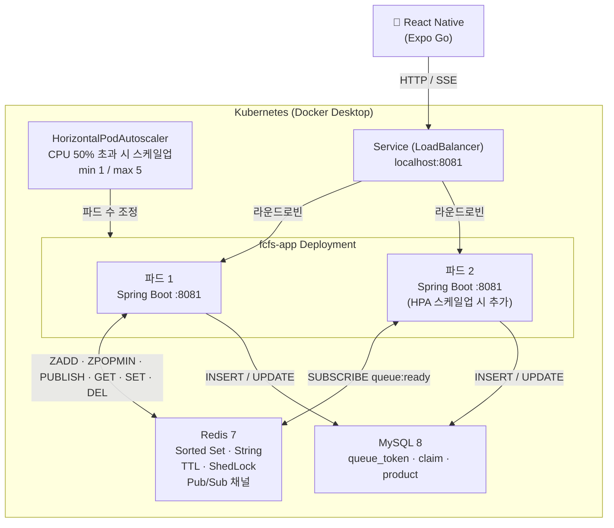
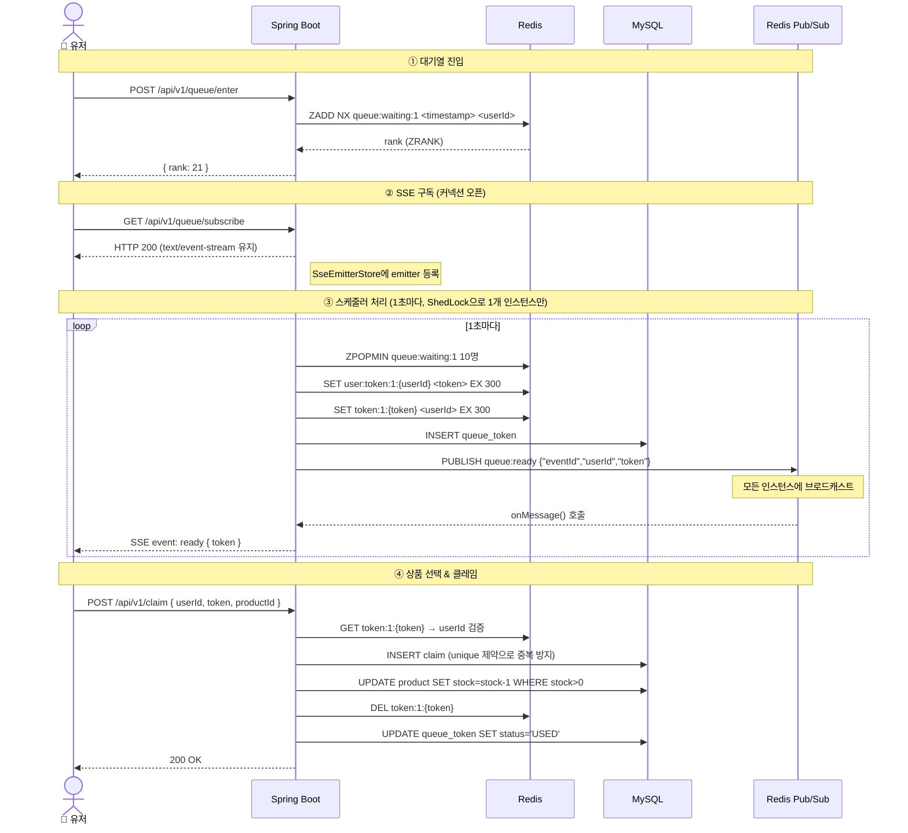
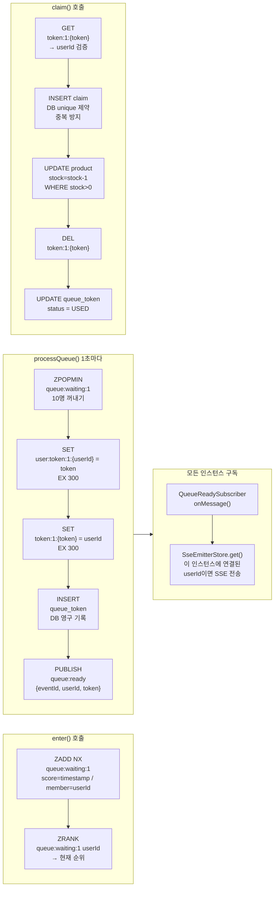
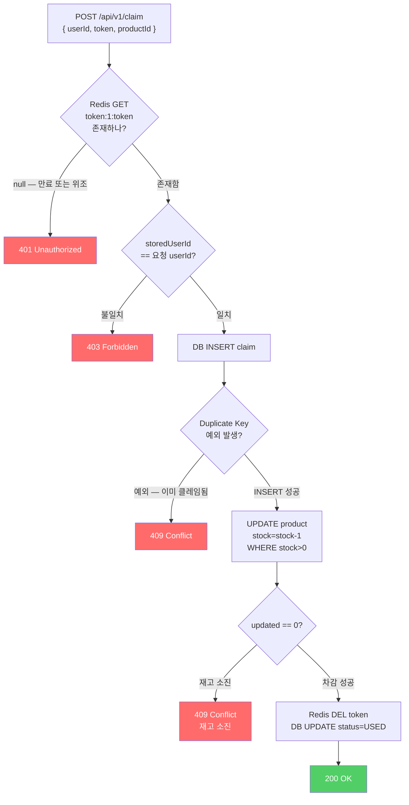

# 면접 Q&A — FCFS Claim 시스템

선착순 한정 수량 지급 시스템 프로젝트 기반 면접 예상 질문과 답변.

---

## 시스템 흐름도

### 1. 인프라 구조 (Kubernetes 기준)

---

### 2. 전체 유저 플로우

---

### 3. Redis 키 구조와 명령 흐름

---

### 4. 중복 클레임 방지 흐름

---

## 1. 프로젝트 소개

**Q. 이 프로젝트를 간단히 소개해주세요.**

> 스타벅스 프리퀀시 같은 선착순 한정 수량 지급 시스템을 직접 구현한 프로젝트입니다. Spring Boot 백엔드와 React Native 프론트엔드로 구성된 모노레포이며, 대기열 입장 → 순서 대기 → 토큰 발급 → 상품 선택 → 클레임까지의 전체 흐름을 구현했습니다. 단순 기능 구현보다는 동시성 처리, 다중 인스턴스 환경에서의 상태 공유, Kubernetes HPA 자동 스케일링, k6 부하 테스트를 목적으로 진행했습니다.

---

## 2. 아키텍처 전반

**Q. 전체 시스템 구조를 설명해주세요.**

> Kubernetes를 사용해서 Spring Boot 파드를 자동 스케일링합니다. K8s Service(LoadBalancer 타입)가 클라이언트 요청을 여러 파드에 분산합니다. 파드들은 Redis를 공유 상태 저장소로 사용하고, MySQL에 클레임 이력을 영구 보관합니다.
>
> 초기에는 Docker Compose로 app1/app2를 고정 2개로 운영했는데, 이벤트 트래픽은 시작 순간 폭증했다가 빠르게 줄어드는 특성이라 고정 인스턴스가 비효율적입니다. Kubernetes HPA를 도입해서 CPU 사용률 50%를 기준으로 파드를 최소 1개에서 최대 5개까지 자동으로 늘리고 줄입니다.

**Q. Docker Compose에서 Kubernetes로 전환한 이유가 뭔가요?**

> Docker Compose는 `app1`, `app2`처럼 인스턴스 수를 코드에 하드코딩해야 합니다. 평소엔 2개가 과하고, 선착순 이벤트 시작 순간엔 2개도 부족한 상황이 생깁니다. 인스턴스를 추가하려면 compose 파일을 수정하고 다시 올려야 하는데 개발자가 개입해야 합니다.
>
> Kubernetes HPA는 metrics-server가 수집한 CPU 사용률을 보고 알아서 파드를 추가하거나 줄입니다. 이벤트 시작 순간 트래픽이 몰리면 자동으로 파드가 늘어나고, 이벤트가 끝나면 다시 줄어듭니다. 개발자가 개입하지 않아도 됩니다.

**Q. 왜 모노레포 구조를 선택했나요?**

> 백엔드와 프론트엔드가 하나의 프로젝트로 긴밀하게 연동되는 시스템이라 API 스펙이 자주 바뀝니다. 레포를 분리하면 양쪽을 동시에 수정할 때 PR을 두 곳에 올려야 하고 변경 이력 추적도 어렵습니다. 모노레포로 두면 하나의 커밋에서 백엔드 API 변경과 프론트 코드 변경을 같이 볼 수 있어서 히스토리 관리가 편합니다.

---

## 3. 대기열 설계

**Q. 대기열을 어떻게 구현했나요?**

> Redis의 Sorted Set 자료구조를 사용했습니다. 유저가 입장할 때 `ZADD queue:waiting:{eventId} <입장시각> <userId>` 명령으로 추가합니다. Sorted Set은 score 기준으로 항상 정렬되어 있어서, 입장 시각을 score로 쓰면 먼저 들어온 순서대로 자동 정렬됩니다. 순위 조회는 `ZRANK` 명령으로 O(log N)에 처리합니다.
>
> 1초마다 실행되는 스케줄러가 `ZPOPMIN` 명령으로 앞에서 10명씩 꺼내 UUID 토큰을 발급합니다. ZPOPMIN은 꺼내는 동시에 Set에서 제거하는 원자적 연산이라 다중 인스턴스에서도 같은 유저가 중복 처리되지 않습니다.

**Q. 처음에는 어떻게 구현했고, 어떤 문제가 있었나요?**

> 처음에는 JVM 메모리의 ConcurrentHashMap과 AtomicLong으로 구현했습니다. 단일 서버에서는 정상 동작했지만 두 가지 버그가 있었습니다.
>
> 첫 번째는 cursor 선행 버그입니다. `@Scheduled`가 서버 시작부터 1초마다 cursor를 +10씩 올리다 보니, 서버 기동 30초 후에 첫 유저가 입장하면 cursor=300인데 seq=1이라 즉시 토큰이 발급됐습니다.
>
> 두 번째는 다중 인스턴스 문제입니다. app1과 app2가 각자 AtomicLong을 가지고 있어서 순번이 충돌하고, 스케줄러도 양쪽에서 동시 실행되어 10명이 아닌 20명이 한 번에 처리됐습니다.
>
> Redis 전환으로 두 문제를 모두 해소했습니다. ZPOPMIN은 실제 대기열에서만 꺼내오니 선행 문제가 없고, Redis 자체가 단일 스레드라 원자성이 보장됩니다.

**Q. ZADD할 때 score로 timestamp를 쓰는 이유가 뭔가요?**

> 정수 카운터도 가능합니다. 다만 Redis에서 원자적 증가 카운터(`INCR`)를 별도로 관리해야 하는 부담이 생깁니다. timestamp를 쓰면 별도 카운터 없이 입장 시각 자체가 자연스러운 정렬 기준이 됩니다. 밀리초 단위라 같은 ms에 여러 명이 동시에 들어오면 score가 같아지는데, Redis Sorted Set은 score가 같으면 member의 사전순으로 정렬합니다. ms 단위 동시 입장은 실질적으로 구분이 불가능하므로 허용 가능한 수준입니다.

---

## 4. Redis

**Q. Redis를 왜 선택했나요?**

> 이 프로젝트에서 필요한 기능이 단순 key-value 캐시가 아닙니다. 순위 조회(Sorted Set), TTL 자동 만료(String with EX), 원자적 pop(ZPOPMIN), 인스턴스 간 이벤트 전달(Pub/Sub) 등 다양한 자료구조와 명령어가 필요합니다. Memcached는 key-value만 지원해서 이런 복잡한 연산을 애플리케이션 레벨에서 직접 구현해야 합니다.

**Q. Redis는 싱글스레드인데 어떻게 원자성이 보장되나요?**

> Redis는 명령 처리를 단일 스레드로 순차적으로 실행합니다. app1과 app2가 동시에 ZPOPMIN을 보내도 Redis 내부에서는 하나씩 처리합니다. 첫 번째 ZPOPMIN이 10명을 꺼내고 Set에서 제거한 다음, 두 번째 ZPOPMIN이 실행될 때는 이미 10명이 없는 상태입니다.

**Q. Redis 키를 어떻게 설계했나요?**

> 세 종류의 키를 사용합니다.
> - `queue:waiting:{eventId}` — Sorted Set. 대기 중인 유저들의 줄.
> - `user:token:{eventId}:{userId}` — String. 특정 유저에게 발급된 토큰. `getStatus()` 조회용.
> - `token:{eventId}:{uuid}` — String. 토큰이 누구 것인지 역방향 인덱스. Claim API 검증용.
>
> 키 이름에 `{eventId}`를 포함시킨 이유는 이벤트 격리입니다. 여러 이벤트가 동시에 진행될 때 키가 섞이지 않도록 합니다.

**Q. 토큰에 TTL을 왜 걸었나요?**

> 토큰 유효 시간을 5분으로 제한합니다. 5분 안에 클레임하지 않으면 기회가 사라집니다. TTL을 쓰면 만료 스케줄러를 별도로 만들 필요 없이 Redis가 알아서 키를 삭제합니다. Claim API에서 Redis 키가 없으면 만료로 판단하면 되니까 만료 처리 로직이 단순해집니다.

**Q. Redis가 장애나면 어떻게 되나요?**

> 현재 구현에서는 대기열 상태가 사라집니다. 이건 알고 있는 한계입니다. 운영 환경에서는 Redis Sentinel(자동 장애 감지 + 페일오버)이나 Redis Cluster(샤딩 + 복제)를 써서 가용성을 높입니다. 토큰 발급 이력은 MySQL에도 저장하기 때문에 "누가 토큰을 받았는가"에 대한 기록은 Redis 장애와 무관하게 남아있습니다.

---

## 5. 동시성과 중복 방지

**Q. 같은 유저가 토큰을 두 번 받는 걸 어떻게 막나요?**

> 두 단계로 막습니다.
>
> 첫째, 대기열 진입 시 `ZADD NX`(addIfAbsent)를 사용합니다. 이미 Set에 있는 userId는 추가되지 않아서 대기열에 한 번만 들어갑니다.
>
> 둘째, `queue_token` 테이블에 `UNIQUE KEY (event_id, user_id)` 제약이 있습니다. 스케줄러가 토큰을 발급할 때 DB에 INSERT하는데, 같은 이벤트에서 같은 유저의 레코드가 이미 있으면 INSERT가 실패합니다. 이 DB 제약이 최종 보루입니다.

**Q. Claim API에서 중복 클레임을 어떻게 방지하나요?**

> 두 겹으로 방어합니다.
>
> 1차: Redis에서 토큰을 조회합니다. 없으면 만료 또는 이미 소진된 것이므로 즉시 거절합니다.
>
> 2차: `claim` 테이블에 INSERT합니다. `UNIQUE KEY (event_id, user_id)`가 있어서 같은 유저가 두 번 INSERT하려 하면 `DataIntegrityViolationException`이 발생하고, 이를 409 Conflict로 응답합니다.
>
> 1차만으로 부족한 이유가 있습니다. 동시에 두 요청이 들어왔을 때 둘 다 Redis 조회를 통과한 뒤, 첫 번째 요청이 `redis.delete()`를 하기 전에 두 번째 요청도 조회를 통과하는 race condition이 이론적으로 가능합니다. DB unique constraint가 이 경우를 최종적으로 막아줍니다.

**Q. 재고 차감을 어떻게 구현했나요? 동시에 여러 요청이 들어오면 재고가 마이너스가 되지 않나요?**

> `UPDATE product SET stock = stock - 1 WHERE id = ? AND stock > 0` 한 줄로 처리합니다. WHERE 조건에 `stock > 0`을 포함시켜서 재고가 0이면 UPDATE가 실행되지 않습니다. JPA의 `@Modifying` 쿼리로 반환값이 0이면 재고 소진으로 판단해 409를 응답합니다.
>
> 이 방식이 Optimistic Lock이나 Pessimistic Lock보다 단순한 이유는, MySQL의 UPDATE 자체가 row-level lock을 사용해 원자적으로 실행되기 때문입니다. 별도 락 전략 없이도 동시 요청이 들어와도 재고가 정확하게 차감됩니다.

**Q. @Transactional을 Claim API에 적용한 이유는요?**

> Claim 처리 시 `claim` 테이블 INSERT, `product` 재고 차감, `queue_token` 상태 UPDATE 세 가지 DB 작업이 일어납니다. 하나만 성공하고 나머지가 실패하면 데이터 불일치가 생깁니다. `@Transactional`로 묶어서 전부 성공하거나 전부 롤백되도록 보장합니다.
>
> 단, Redis 작업(토큰 삭제)은 트랜잭션 밖이라 롤백 대상이 아닙니다. Redis 삭제 후 DB 작업이 실패하는 경우가 이론적으로 있지만, 토큰은 TTL 5분 후 자동 만료되고, DB unique constraint가 최종 중복을 막기 때문에 실질적인 문제가 되지 않습니다.

---

## 6. ShedLock

**Q. ShedLock을 쓴 이유가 뭔가요?**

> `@Scheduled`는 스프링 컨텍스트가 뜬 모든 인스턴스에서 동시에 실행됩니다. 파드가 2개면 `processQueue()`도 2개가 동시에 실행되어 10명이 아닌 20명이 한 번에 처리되고 순서가 깨집니다.
>
> ShedLock은 스케줄러 실행 전에 Redis에 `SETNX`로 락 키를 만듭니다. 먼저 락을 잡은 인스턴스만 실행하고, 나머지는 이미 키가 있으므로 실행을 건너뜁니다. 락 키에 TTL을 붙여서 인스턴스가 장애로 죽어도 자동 해제됩니다.

**Q. `lockAtLeastFor`는 왜 필요한가요?**

> `fixedDelay = 1000`이면 실행 완료 후 1초 대기 후 다시 실행합니다. 대기열이 비어서 실행이 1ms 만에 끝났을 때 락을 바로 해제하면, app2가 바로 락을 잡아서 거의 동시에 두 번 실행될 수 있습니다. `lockAtLeastFor = "PT1S"`는 실행이 빨리 끝나도 최소 1초는 락을 유지해서 이 상황을 막습니다.

---

## 7. SSE와 Redis Pub/Sub

**Q. 폴링 대신 SSE를 선택한 이유는요?**

> 2초 폴링은 유저가 1000명이면 초당 500건의 요청이 "아직 아닌가요?" 확인에만 쓰입니다. SSE는 클라이언트가 HTTP 커넥션 하나를 열어두고 서버에서 이벤트가 생겼을 때만 데이터를 밀어줍니다. 토큰이 발급되기 전까지 서버는 이 커넥션에 아무것도 안 해도 됩니다.

**Q. SSE와 WebSocket의 차이가 뭔가요? 여기서 WebSocket을 안 쓴 이유는요?**

> SSE는 서버 → 클라이언트 단방향 스트리밍입니다. 일반 HTTP 프로토콜 위에서 동작해서 별도 업그레이드 핸드셰이크가 없습니다. WebSocket은 양방향 통신이 가능하지만 프로토콜 업그레이드가 필요하고 구현이 복잡합니다. 대기열 알림은 "차례가 됐습니다"를 한 번 알려주는 단방향 이벤트라 SSE가 적합합니다.

**Q. SSE가 다중 인스턴스 환경에서 문제가 있다고 했는데, 어떻게 해결했나요?**

> 문제: 유저가 파드1에 SSE 연결을 맺으면 `SseEmitterStore`가 파드1 메모리에만 있습니다. ShedLock을 잡은 스케줄러가 파드2에서 실행되면 파드2 메모리에서 이 유저의 emitter를 찾지 못해 알림이 전달되지 않습니다.
>
> 해결: Redis Pub/Sub을 도입했습니다. 스케줄러가 토큰을 발급하면 직접 SSE를 보내는 대신, Redis `queue:ready` 채널에 `{"eventId", "userId", "token"}` 메시지를 발행합니다. 모든 파드가 이 채널을 구독하고 있어서 메시지를 받으면 각자 자기 메모리에서 해당 유저의 emitter를 찾습니다. emitter가 있는 파드만 실제로 전송하고, 없는 파드는 무시합니다. 이 방식으로 어떤 파드에 연결된 유저든 알림을 받을 수 있습니다.

**Q. k6 부하 테스트에서는 SSE 다중 인스턴스 문제가 재현됐나요?**

> 재현되지 않았습니다. k6 테스트 스크립트는 SSE가 아닌 폴링 방식으로 토큰 발급을 기다립니다. `/queue/status` 엔드포인트를 1초마다 직접 호출해서 token 여부를 확인합니다. 폴링은 상태 비저장(stateless) 방식이라 어느 파드가 응답해도 Redis에서 동일한 값을 읽어 정상 동작합니다.
>
> SSE 다중 인스턴스 문제가 실제로 터지려면 React Native 앱에서 SSE로 연결한 실제 유저와, HPA로 파드가 2개 이상인 상태가 동시에 필요합니다. k6 부하 테스트 자체는 SSE를 사용하지 않아서 이 시나리오를 직접 검증하기 어렵습니다. 다만 Pub/Sub 구현은 코드 레벨에서 올바르게 동작하고, 단일 인스턴스 환경에서는 동작이 확인됩니다.

---

## 8. 만료 토큰 배치

**Q. Redis TTL로 토큰을 만료시키는데 DB 배치까지 필요한 이유가 뭔가요?**

> Redis TTL이 만료되면 Claim API에서 토큰을 거절하는 기능적 동작은 정상입니다. 하지만 DB의 `queue_token` 레코드는 여전히 `status = VALID`로 남습니다. 나중에 "이 유저는 왜 클레임을 못 했지?"를 분석할 때 DB만 보면 토큰이 유효한 것처럼 보여서 잘못된 판단을 할 수 있습니다.
>
> 1분마다 실행되는 배치가 `expiresAt < NOW() AND status = VALID`인 레코드를 `EXPIRED`로 업데이트합니다. Redis 상태와 DB 상태를 일치시켜 감사(audit) 목적의 데이터 신뢰성을 높입니다.

**Q. 배치 스케줄러도 ShedLock을 써야 하나요?**

> 네, 써야 합니다. 배치가 ShedLock 없이 실행되면 파드 2개가 동시에 같은 범위의 레코드를 UPDATE합니다. MySQL은 row-level lock 덕분에 실제로 중복 UPDATE가 되지는 않지만, 불필요한 DB 부하가 생깁니다. ShedLock으로 1개 파드에서만 실행하면 됩니다.
>
> `lockAtMostFor`도 중요합니다. 배치 실행 중 파드가 죽으면 락이 영구적으로 남아 다음 주기에도 실행이 안 됩니다. `PT55S`로 설정해서 55초 후에는 강제 해제되도록 했습니다.

---

## 9. Kubernetes와 HPA

**Q. HPA(HorizontalPodAutoscaler)가 어떻게 동작하나요?**

> metrics-server가 10초마다 각 파드의 CPU 사용량을 수집합니다. HPA가 이 값으로 사용률을 계산합니다. 사용률이 설정한 임계값(50%)을 초과하면 필요한 파드 수를 계산합니다.
>
> 공식: `필요 파드 수 = ceil(현재 파드 수 × 현재 사용률 / 목표 사용률)`
>
> 예를 들어 파드 1개가 CPU 80%를 사용하면 `ceil(1 × 80% / 50%) = 2개`로 늘립니다. 15초 동안 연속으로 임계값을 초과해야 실제로 스케일업합니다. 일시적인 스파이크에 과잉 반응하지 않도록 안정화 창(stabilizationWindow)을 뒀습니다.

**Q. HPA에 `resources.requests.cpu`가 반드시 필요한 이유는요?**

> HPA는 CPU 사용률을 `실제 사용 CPU / requests.cpu`로 계산합니다. `requests.cpu`가 없으면 분모가 없어서 계산이 불가능합니다. K8s는 이 경우 HPA 자체를 동작시키지 않습니다.
>
> `requests.cpu = "500m"`으로 설정하면 0.5코어를 기준으로 사용률을 계산합니다. 실제로 100m(0.1코어)를 사용하고 있다면 `100 / 500 = 20%`입니다.

**Q. 새 파드가 뜰 때 CPU가 갑자기 급등했는데 이유가 뭔가요?**

> JVM 특성 때문입니다. Java는 처음 실행 시 클래스 로딩과 JIT(Just-In-Time) 컴파일이 집중적으로 발생합니다. Spring Boot는 자동 구성 클래스가 많아서 초기화 부하가 특히 큽니다. 30초 정도 지나면 JIT 컴파일이 완료되고 CPU 사용률이 안정됩니다.
>
> `readinessProbe`에 `initialDelaySeconds: 30`을 설정한 이유가 이것입니다. 파드가 올라오는 30초 동안은 트래픽을 받지 않아서 JVM warm-up 중인 파드로 요청이 가지 않습니다.

**Q. Docker Desktop K8s에서 이미지를 로드하는 게 왜 까다로웠나요?**

> Docker Desktop의 K8s는 컨테이너 런타임으로 containerd를 사용합니다. Docker daemon도 내부적으로 containerd를 쓰지만, 이미지를 저장하는 네임스페이스가 다릅니다.
>
> - Docker daemon이 저장하는 이미지: `moby` 네임스페이스
> - K8s가 파드를 실행할 때 찾는 이미지: `k8s.io` 네임스페이스
>
> `docker build`로 만든 이미지는 `moby`에만 있어서 K8s가 찾지 못하고 `ErrImageNeverPull`이 발생했습니다. `kubectl debug node`로 K8s 노드에 진입해서 `ctr -n k8s.io images import`명령으로 직접 `k8s.io` 네임스페이스에 이미지를 임포트해서 해결했습니다.

---

## 10. DB 설계

**Q. DB 정규화 관점에서 의도적으로 정규화를 어긴 부분이 있나요?**

> `claim` 테이블에 `event_id` 컬럼이 있습니다. `claim`은 이미 `user_id`와 `product_id`를 가지고 있고, `product`에서 `event_id`를 조인으로 찾을 수 있습니다. 3NF 관점에서는 `event_id`가 중복 정보입니다.
>
> 그럼에도 의도적으로 뒀습니다. 클레임 내역을 조회할 때 "이벤트 ID 기준으로 전체 클레임 건수를 집계"하는 쿼리가 자주 발생합니다. `event_id`가 없으면 `product` 테이블을 조인해야 합니다. 조인 없이 `claim.event_id`로 바로 필터링하면 조회 성능이 월등히 좋습니다. 이 트레이드오프를 알고 있고, 쓰기 시 중복 저장을 감수하고 읽기 성능을 선택했습니다.

**Q. 상품 색상 데이터를 DB에서 프론트엔드로 옮긴 이유는요?**

> 초기 설계에서 `product` 테이블에 `image_color`, `image_color_end` 컬럼을 뒀습니다. 이 컬럼들은 순수하게 화면 표시용 UI 데이터입니다. DB는 비즈니스 데이터를 저장하는 곳인데 UI 스타일 값이 섞이는 건 관심사 분리 위반입니다.
>
> 또한 색상을 바꾸려면 DB를 직접 수정해야 하는데, UI 변경에 DB 마이그레이션이 필요한 건 과도한 결합입니다. 프론트엔드 상수(`productThemes.ts`)로 옮겨서 색상 변경은 프론트 배포만으로 가능하게 했습니다. DB 테이블도 가벼워졌습니다.

---

## 11. Outbox 패턴과 분산 트랜잭션

**Q. DB와 Redis를 같이 쓰는데 Outbox 패턴이나 보상 트랜잭션이 필요하지 않나요?**

> 이 시스템에서는 필요하지 않습니다. Outbox 패턴이 필요한 상황은 DB 쓰기와 메시지 발행이 반드시 함께 성공해야 하고, 실패 시 비즈니스가 심각하게 망가지는 경우입니다. 예를 들어 주문 DB에 저장됐는데 결제 서비스로 메시지가 안 가면 결제가 영원히 안 되는 상황입니다.
>
> 이 시스템에서 DB + Redis 쓰기 실패 시나리오를 분석하면:
>
> `processQueue()`에서 Redis에 토큰은 저장됐지만 DB INSERT가 실패해도, 유저는 여전히 클레임 가능합니다. DB 감사 로그만 누락되는 것이고, Redis TTL 300초 후 자동 정리됩니다.
>
> `claim()`에서 DB 트랜잭션은 성공했지만 Redis 토큰 삭제가 실패해도, DB의 unique constraint가 두 번째 클레임을 막아줍니다. 토큰은 TTL 후 자동 만료됩니다.
>
> 핵심 비즈니스 일관성("누가 클레임했는지, 재고가 몇 개인지")은 전부 DB 트랜잭션 안에서 보장됩니다. Redis는 성능을 위한 보조 저장소 역할이고, 실패해도 TTL이 자연적인 보상 역할을 합니다. Outbox가 필요해지는 시점은 Redis가 "외부 결제 시스템 호출"처럼 반드시 처리되어야 하는 작업을 담당할 때입니다.

---

## 12. 부하 테스트 (k6)

**Q. k6로 어떤 테스트를 했나요?**

> 세 가지 시나리오를 작성해 실행했습니다.
>
> 첫째, 대기열 스트레스 테스트(`01_queue_stress.js`)입니다. 5초 동안 50명에서 시작해 10초 동안 100명까지 올리면서 `/queue/enter`에 집중적으로 요청합니다. 8821건을 440 req/s로 처리하면서 에러율 0%, p95 94ms를 달성했습니다.
>
> 둘째, 클레임 경쟁 테스트(`02_claim_race.js`)입니다. 토큰을 미리 발급한 뒤 동시에 클레임을 시도해서 재고 소진 처리가 올바른지 확인합니다.
>
> 셋째, 전체 플로우 테스트(`03_full_flow.js`)입니다. 입장 → 토큰 대기(폴링) → 클레임까지 실제 유저 흐름을 시뮬레이션합니다. 20명이 동시에 플로우를 완료했고, p95 93ms로 기준치(1000ms)를 충분히 통과했습니다.

**Q. k6 테스트와 실제 앱 동작 사이에 차이가 있나요?**

> 있습니다. k6는 토큰 발급을 기다릴 때 폴링(`/queue/status` 1초마다 호출)을 씁니다. 실제 React Native 앱은 SSE(`/queue/subscribe`)로 연결해서 서버가 밀어주는 이벤트를 기다립니다.
>
> 이 차이로 인해 SSE 다중 인스턴스 문제는 k6 테스트에서 재현되지 않습니다. 폴링은 상태 비저장이라 어느 파드가 응답해도 Redis에서 동일한 결과를 읽습니다. 반면 SSE는 특정 파드의 메모리에 연결이 저장되어 있어서 파드가 여러 개일 때 문제가 생깁니다. 이 차이를 인식하고 Redis Pub/Sub으로 SSE 문제를 별도로 해결했습니다.

**Q. k6로 HPA 스케일업을 확인했나요?**

> 네. HPA 임계값을 테스트용으로 5%로 낮춘 뒤 100 VU 스트레스 테스트를 실행하면서 `kubectl get hpa`와 `kubectl top pods`로 실시간 모니터링했습니다. CPU가 5%를 초과하자 15초 안정화 창 후에 파드가 1개에서 2개로 자동 확장됐습니다. 신규 파드가 JVM 기동 중 CPU를 975m까지 사용하는 것도 확인했습니다. 테스트 후 임계값은 50%로 원복했습니다.

---

## 13. 개선 방향

**Q. 이 프로젝트에서 더 개선할 점을 알고 있나요?**

> 몇 가지가 있습니다.
>
> 첫째, SSE Pub/Sub은 구현했지만 통합 테스트가 없습니다. 실제로 파드가 2개인 상태에서 앱 유저가 SSE로 연결했을 때 알림이 정상 도달하는지 확인하는 테스트가 필요합니다.
>
> 둘째, 현재 `processQueue()` 스케줄러가 `eventId = 1L`로 하드코딩되어 있습니다. 실제 서비스에서는 DB에서 현재 진행 중인 이벤트 목록을 조회해서 동적으로 처리해야 합니다.
>
> 셋째, K8s 이미지 배포 과정이 수동입니다. `docker build` → `ctr import` 과정을 CI/CD 파이프라인으로 자동화하거나, 실제 컨테이너 레지스트리(ECR, GCR)를 붙이면 훨씬 편해집니다.
>
> 넷째, MySQL도 단일 파드로 운영 중이라 장애 시 복구 방법이 없습니다. 운영 환경에서는 PersistentVolumeClaim으로 데이터를 영구 보관하고 읽기 부하 분산을 위한 레플리카를 둬야 합니다.
